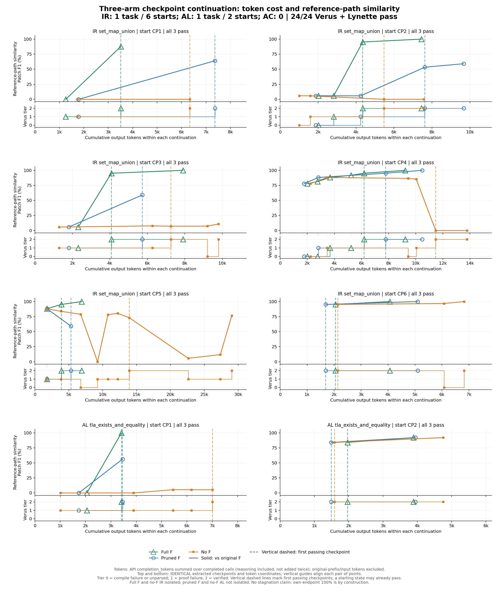
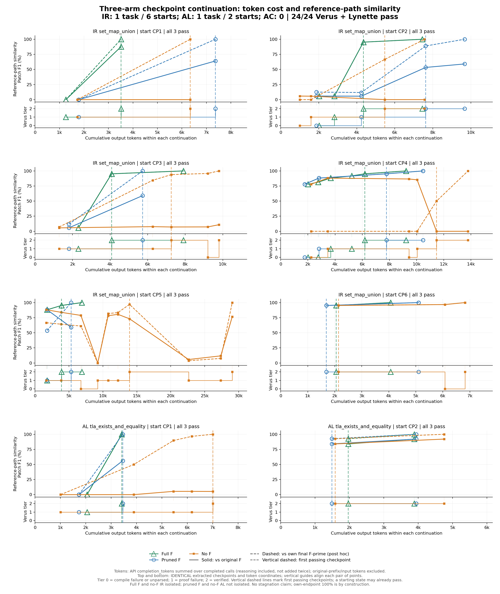

# 三组 checkpoint augmentation 对比

**三组均完成8条续跑并通过Verus＋Lynette。在当前两题实验中，有F参考组主要沿用原证明策略，部分续跑以更简洁的证明实现完成；完整F组更贴近原F，精简F组更常省略显式证明步骤；无参考组在IR题上出现库引理复用和量词改写两类替代路线。当前已获得可用于生成skill的训练材料，尚未检验SkillOpt收益。**

## 实验设置与结果

模型统一为DeepSeek V4 Pro，blank条件，每个起点续跑一次、限时600秒，使用既定过程约束。起点沿用Yuechun原checkpoint提取逻辑，三组逐点源码SHA一致。

每组包含同一固定40题train中的两题：**IR（IronKV）`set_map_union`：1题6条；AL（Anvil库）`tla_exists_and_equality`：1题2条；AC（Anvil控制器）：0题。** 共24条续跑，但只有2道独立题目。

| 组别 | 给模型的参考 | 双验证通过 | 与原策略相比 |
|---|---|---:|---|
| 完整F | 原始最终proof | 8/8 | 主要重构原证明；6条终点对原F的Patch F1为1 |
| 精简F | 验证通过的精简proof | 8/8 | 主要保留见证路线，减少显式步骤或做局部修复 |
| 无参考 | 不给最终proof | 8/8 | IR有4条采用替代路线；AL主要保留原见证辅助引理路线 |

无参考组由**隔离重跑的IR 6条＋旧无参考AL 2条**组成，不含旧IR污染样本。完整F组和无参考IR启用main隔离，精简F和旧AL未启用；这是同题同起点的配对比较，环境差异仍限制因果归因。精简IR CP3的访问问题暂搁置，详见审计记录。

## 三组曲线



绿色空心三角＝完整F；蓝色空心圆＝精简F；橙色方块＝无参考。**此图三组统一对原始F评分。**



第二张图中，**实线对原始F评分，虚线对各条续跑自身的最终F′评分**；颜色仍区分三组。虚线终点为1是定义上的结果，不代表该组优于其他组。

- 子图按IR CP1→CP6、AL CP1→CP2排列；同题CP编号越大，表示起点在原轨迹中越靠后。
- 横轴是**本条续跑累计输出token**，由逐调用API账本按完成时间对齐verifier事件，包含reasoning、不含输入token。三组独立累计，首个观察点可能已消耗token。
- **上下图使用完全相同的一批checkpoint、同一个事件的累计token坐标，点逐一竖直对齐。** 淡色竖线贯穿上下图；各组同色竖虚线标出该组首个通过的checkpoint。起点本身也可能已经通过。
- 下方只显示这些checkpoint对应的验证状态：0＝编译失败／未解析，1＝证明失败，2＝验证通过。被原提取器去重的重复验证不再单独画点，故此图不是全部verifier调用记录；完整记录仍保留在数据文件中。
- Patch F1是**参考路径相似度，不是通用证明进度**。自身终点曲线的最终1是定义上的结果。

## IR各组最终proof长什么样

[查看完整源码对照：原F、精简F及三组18条续跑的最终proof](IR_FINAL_PROOFS.md)。相同源码合并展示，表格可定位每个CP。最明显的区别是：原F手写双向见证证明，无参考CP2的整个proof body只有下面一行，而无参考CP3改为量词等价辅助引理：

```rust
s1.lemma_map_union_commute(s2, f);
```

这行调用的是已证明的vstd库定理。完整F组CP2–6、精简F组CP4/6、无参考CP6则与原F逐字一致；精简F组CP2/3/5与精简F逐字一致。其余实际代码和差异说明见对照文档。

## 核心发现

**1. 有F参考组倾向于沿用原证明策略，部分结果更简洁。** 在当前两题中，完整F／精简F组主要保留原trace中的见证选择、成员分支或见证辅助引理路线，未观察到无参考IR中出现的库定理复用或量词改写替代路线。完整F组更偏向恢复原证明；精简F组可省去由自动推理完成的方向或冗余断言。例如精简IR CP2/3/5保留一个显式包含方向，精简AL CP1只显式证明反向蕴含，仍通过完整验证。

这里的“沿用”指**核心证明策略相同，不是重复原trace的编辑与试错顺序**；“更简洁”主要指证明实现，不能直接推出耗时或token更少。模型只获得checkpoint代码和指定参考，并未获得原trace前缀。此结论是两题上的观察，不是参考可见性的一般因果结论。

**2. 无参考IR出现相对原轨迹的替代路线。** 原证明采用集合外延性、双向choose原像见证和成员分支。无参考CP1/2/4改为直接复用库定理；CP3改为成员等价辅助引理与量词改写；CP5保留见证路线并分解辅助引理，CP6仅修复宏路径。因此是4条呈现两类替代路线，不是发现4种新数学策略。

**3. 更像原F不代表更正确。** 无参考IR CP1/2/4的终点原F评分为0，CP3为0.109，但都通过验证。完整F组多数终点高度匹配参考，符合参考引导的预期，不能据此判断学习价值更高。

**4. 更多checkpoint不等于解题更慢，也不等于更有价值。** IR CP4中，精简F组用3次修改完成；完整F组用5次，差别是分批删除trigger、分方向补前提，不是增加了新证明思路。按逐调用账本，IR CP4完整F组总输出10,825 token，精简F组11,605 token：更多修改并未对应更多输出token。输出token仍不等于总费用或墙钟耗时。后期起点更常保留原路线只是当前IR单题的观察，可能因为起点已带有较完整的proof。

**5. trace可用于训练，但需先整理格式。** 精简／完整F两组16条已审计：28次实际修改后都有真实Verus反馈，最终均通过双验证。按已确认口径，使用起始代码、实际修改及工具反馈作为训练材料，排除模型自我解释；中间失败保留失败标签。参考复现本身不作为判废理由。当前`conversation.json`仍含自述，导出整理与optimizer接入尚未执行。

## 下一步

先整理训练导出格式，保留同题同起点的原／新路径、参考条件和验证证据。随后固定材料与预算，比较**随机混合、同题对照成组、分组加逻辑顺序**，检验老师提出的batch／curriculum思路。现有结果支持材料可组织性，尚未证明这种组织能产生更好的skill。

[核心代码与复现说明](CODE.md) · [24条结果与校验摘要](results.json) · [起点合同](CHECKPOINT_CONTRACT.md) · [过程审计摘要](AUDIT.md)
