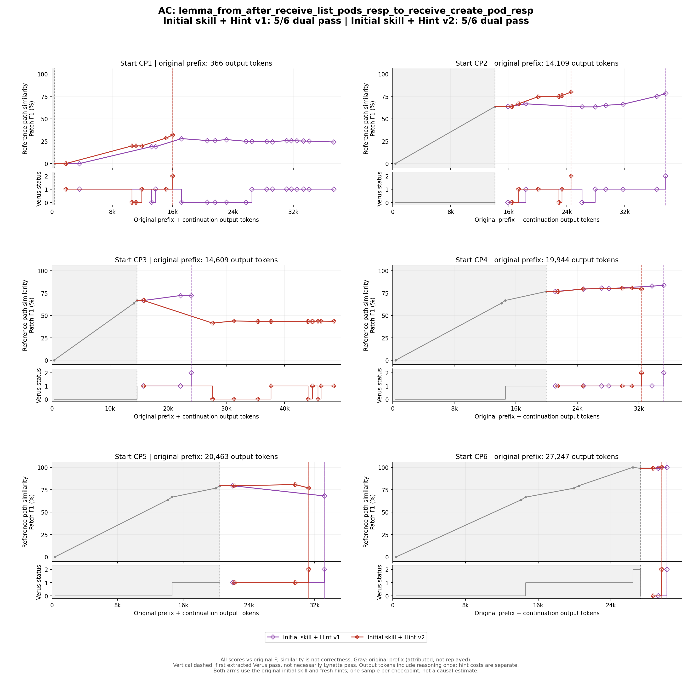

# AC · Initial skill + Hint v2：逐checkpoint语义审计

**本版全部6条过程审计完成，待用户复核。** 审查保存的起点、hint正文、每次源码变化、实际工具反馈及最终宿主验证；本次没有重新调用模型或验证器。最终正确与中间每一步正确分开判断。

两版均5/6，但失败点不同：v1 CP1、v2 CP3，均约600秒actor超时且最终Verus失败、Lynette通过。v1 CP2筛查误报已补跑成功。核心难点是将状态层消息存在性落实到temporal family见证，不能把失败笼统归为兼容提醒。

## 先读懂原题与原F

本题要证明：从收到list-pods响应的状态，最终到达收到create-pod成功响应的状态，并把pod数量差从diff推进到diff+1。原文件已有两个消息级组件引理，分别处理“具体list响应→pending create请求”和“具体create请求→成功响应”。当前任务是组合它们，不是重证整个控制器。

令P表示整体list响应状态，Q表示pending create状态，R表示目标成功响应状态。原F的逻辑连接为：`P → 存在具体响应 → Q → 存在具体请求 → R`。消息级leads-to引理经`leads_to_exists_intro`提升后，只证明两个消息族的进展；仍需单独证明P蕴含响应族的`tla_exists`，以及Q蕴含请求族的`tla_exists`。

因此“状态中存在某消息”与“某个temporal family在此execution成立”之间不是靠重述目标就自动打通的：必须在execution的head上得到消息见证、验证具体消息谓词，再建立family实例。响应通常从in-flight/matching/OK条件取choose见证；请求可以直接取已经存在的pending消息。CP2是trigger层，CP3是这两个桥接，CP4还有前提未进入量词proof体，CP5仍缺具体见证，CP6则是正确证明被非法auto属性打断。

## 图与版本对照



两版actor输出合计：v1 **106,677**，v2 **90,178**（-15.5%）。包括失败续跑和结束说明，hint生成另计。上图为相对原F的Patch F1，即参考路径相似度；下图为同一观测的Verus状态。横轴包含原前缀归属token，但actor并未回放原前缀；彩色竖虚线仅标首次提取到的Verus通过，不等于Lynette／整个任务完成。

[本版单组图](hint_prefix_tokens.png) · [v1审计](../v1/REPORT.md) · [v2审计](REPORT.md) · [图表数据](../comparison.json)

## 数据和条件核对

来源为Yuechun固定train40中本题的step_0001 DeepSeek v4 Pro原轨迹。全部起点沿用冻结的Yuechun checkpoint提取逻辑；没有按结果另选checkpoint。原轨迹和本轮actor均通过工作区SKILL.md装备同一initial skill，SHA256为`96a557582ff423d159aa97698d3ea1eb55bd07af59cbfd3a518d86326a40df40`。本版每条实际读取全文的事件见下表；不是仅根据文件存在推断使用。

Actor获原题、完整checkpoint代码、fresh hint和skill；hint agent可看原完整轨迹与F。没有把原完整对话或F直接发给actor。38个hint全新生成，旧blank组保持不动。新旧同时变化了skill和hint样本，不能把actor差异单独归因于skill；本轮v1/v2也仅各一次采样，不支持稳定因果结论。

[原题规格与源码](../original_input.rs) · [原trace最终源码F](../original_final.rs) · [原轨迹](../ORIGINAL_CHANGES.md) · [Skill装备核对](../../SKILL_PARITY.md)

## 本版逐点结果

| CP | Actor输出token | 源码变化次数 | 读取skill事件 | 最终Verus＋Lynette |
|---|---:|---:|---|---|
| [CP1](#cp1) | 16,735 | 5 | 11 | 通过 |
| [CP2](#cp2) | 11,723 | 5 | 11 | 通过 |
| [CP3](#cp3) | 33,852 | 11 | 11 | 失败：Verus未解、Lynette通过 |
| [CP4](#cp4) | 13,338 | 4 | 12 | 通过 |
| [CP5](#cp5) | 11,692 | 2 | 15 | 通过 |
| [CP6](#cp6) | 2,838 | 1 | 11 | 通过 |

事件编号使用本条agent_events.jsonl的event_index；源码变化取snapshot差分事件，工具编号取完成命令事件，可能与图中随后保存的verifier事件相差1，不是不同轨迹。源码变化次数不是提取后的checkpoint数。

同版本旧blank审计另见旧v2报告（未随本次发布的本地材料）。下面的逐点版本对照均指**本轮两个initial-skill组**，不混用旧blank结果。

## 逐checkpoint语义审计

<a id="cp1"></a>
### CP1：完成组件组合与两个存在桥接

**客观起点（原trace事件19）。** 空proof，完整leads-to后置条件未证明。

**Hint作何判断。** 两组件、两family和两个见证桥接指向正确。

**实际编辑与验证顺序。** 54构造组合骨架但用保留字final，56失败；62改final_pred，64 trigger失败；69补trigger，71暴露两桥接；80在有if前提保护的execution上选响应见证，82只剩请求；88取pending请求见证，90／95双通过。

**为什么这些修改有效，或仍然失败。** 主链骨架把两个消息组件放到一起，但直接assert两个整体entailment仍缺见证。编译层先修保留字final和trigger后，错误才准确落在这两个桥接；随后第一轮给响应见证，第二轮给pending请求见证，分别填上P与Q进入消息family的缺口。if条件保护了==> proof体中需要的前提，因此即便有该语法warning，最终也不是无前提取choose。

**Hint究竟起了什么作用。** hint三部分——组件组合、响应见证、请求见证——都能找到实际对应；但actor先写高层断言再补细节，仍重现hint已预告的失败。应称最终有效落实，不称一次无错误完成。

**同起点两版对照。** v1本点过度投入请求helper并漏起始桥接，最终失败；v2在主函数完成两边连接。证据支持本次实现更完整，不支持单样本因果结论。 见[另一版CP1](../v1/REPORT.md#cp1)。

**语义审计结论。** 核心hint逐层落实，但没有提前规避保留字、trigger及桥接失败；较v1 CP1完成了整条链，不能单次归因为版本。

**最终检查边界。** 宿主Verus=通过，Lynette=通过；该结论对应链接中的最终candidate hash，不用中途通过替代终点检查。

<details><summary>本次实际发送的hint全文</summary>

The remaining failure is the empty body of lemma_from_after_receive_list_pods_resp_to_receive_create_pod_resp: Verus reports the final leads-to postcondition is not satisfied. The requires are already sufficient, and the two external-body lemmas already cover the message-level transitions: a specific OK list-pods response leads to a pending create-pod request, and a specific create-pod request leads to an OK create-pod response. The next proof objective is to connect those single-message lemmas to the lemma's existentially quantified initial and final state predicates. Introduce temporal intermediate predicates for the specific response message and the specific request message, instantiate the two external lemmas for arbitrary messages, and lift them with leads_to_exists_intro. Then prove the two existential-state entailments by selecting the existing in-flight message with a choose witness and reasserting the exact single-message predicate; avoid leaving the existential witness for the SMT solver to synthesize. Chain the resulting leads-to facts with leads_to_trans. Run Verus and check that the previously failing postcondition at the bottom of the target lemma disappears, then run Lynette.

</details>

[起点源码](../checkpoints/CP01.rs) · [hint原文件](CP01/hint.json) · [全部修改与工具反馈](CP01/PROCESS.md) · [最终源码](CP01/final.rs) · [最终验证](CP01/result.json)

<a id="cp2"></a>
### CP2：trigger后分两侧补见证

**客观起点（原trace事件77）。** 量词trigger失败。

**Hint作何判断。** 准确预告随后两处entailment义务，无凭据的结构风险未加入。

**实际编辑与验证顺序。** 34补trigger，36两断言失败；48响应见证但无有效前提上下文，50失败；56改implies且补existential，58语法失败；63修assert语法，65只剩请求；71补pending请求，73／78双通过。

**为什么这些修改有效，或仍然失败。** 量词trigger只是指定实例化入口，不能提供具体消息。修完后actor按提示选响应，却最初没把源谓词前提带入proof体；改implies后又写错assert exists语法，这两个错误都属于actor实现。修复后响应侧闭合，最后pending请求实例补上另一侧。

**Hint究竟起了什么作用。** 提示同时预告两处桥接，最终执行确实覆盖两边，没有数学误报；但“预告准确”没有转化成“第一次就避开这些错误”。中间语法失败不能被画成已经取得的新证明事实。

**同起点两版对照。** v1也完成同一链但进行了更多状态谓词与局部变量改写；本版更直接，并非另一个数学策略。 见[另一版CP2](../v1/REPORT.md#cp2)。

**语义审计结论。** 提示有效但落实有实现错误；与v1相比少绕几轮，没有新数学策略。

**最终检查边界。** 宿主Verus=通过，Lynette=通过；该结论对应链接中的最终candidate hash，不用中途通过替代终点检查。

<details><summary>本次实际发送的hint全文</summary>

The current blocker is a quantifier-trigger inference failure in the forall assertion that establishes the premise for leads_to_exists_intro over response messages. Add an explicit trigger annotation to the quantified expression that mentions spec.entails, and do the same for the analogous request-message forall assertion. Re-run Verus; this should move the proof past trigger inference. The next likely failures will be the two implication checks from the overall predicate to the existential versions of the response-family and request-family predicates. To close those, expand each implication over an arbitrary execution, expose the current state, prove the concrete in-flight message exists from the source predicate, and name that message with a choose expression. Then assert that the chosen message satisfies the corresponding specific predicate (the in-flight list response predicate, or the in-flight create request predicate), which gives the witness for tla_exists. After Verus accepts the proof, run Lynette; no structural compatibility change outside this proof body is apparent in the current checkpoint.

</details>

[起点源码](../checkpoints/CP02.rs) · [hint原文件](CP02/hint.json) · [全部修改与工具反馈](CP02/PROCESS.md) · [最终源码](CP02/final.rs) · [最终验证](CP02/result.json)

<a id="cp3"></a>
### CP3：抽象化泛型桥接后超时

**客观起点（原trace事件84）。** 原两处存在状态到tla_exists的entailment失败。

**Hint作何判断。** 明确两个见证及implies，数学方向成立；没有要求泛化出通用引理。

**实际编辑与验证顺序。**

| 阶段／事件 | 实际尝试与诊断 | 为什么还不够 |
|---|---|---|
| 56–61：两个专用helper | 将两处entailment移到辅助函数，调用后trigger推断失败 | helper合同也必须证明，拆函数不自动产生存在见证 |
| 69–91：改量词表达 | 改implies、trigger和状态量词，先解析失败再断言失败 | 在合法表达式中证明状态／时序桥接仍未完成 |
| 100–112：新增泛型提升 | 引入state存在性→tla_exists通用helper，处理其trigger | 多了通用合同和调用处实例化义务，部分断言／后置条件仍失败 |
| 117–133：补存在实例 | 添加existential、trigger，再命名temporal family | 两个专用helper调用通用helper的前提及自身后置条件仍未通过 |
| 最终宿主验证 | 2 verified,2 errors；Lynette通过 | 只有部分函数被验证，整个目标未完成，不得把两项局部通过当作成功终点 |

**为什么这些修改有效，或仍然失败。** 专用helper试图把两处execution级entailment移出主函数；之后又抽象成对任意state_pred和消息族都适用的泛型提升引理。这扩大了当前要管理的closure、trigger和合同实例化范围。结尾泛型调用的前提在两个专用helper处未被验证，专用helper后置条件也未通过；因此即便验证统计有2 verified，整体任务仍未解。

**Hint究竟起了什么作用。** hint推荐的是在当前execution上取具体消息，没有要求这层泛化。泛化方向本身不能仅因超时判为数学错误，但本次实现未证成；不能把helper的ensures当现成事实输入训练。日志不支持将失败归为Lynette，因为它最终通过。

**同起点两版对照。** v1同点在原主体用if保护两个见证即成功。本点较有诊断价值的对照是“就地补上下文”与“额外泛化并承担新合同”，不是正确hint与错误hint的简单二分。 见[另一版CP3](../v1/REPORT.md#cp3)。

**语义审计结论。** 真实未解。泛型化是actor自行扩展，不能说hint误导添加错误公理；也不能把2 verified当整体成功。本点仅作失败对照。

**最终检查边界。** 宿主Verus=失败，Lynette=通过；该结论对应链接中的最终candidate hash，不用中途通过替代终点检查。 最终Verus统计为`verification results:: 2 verified, 2 errors`。

```text
error: postcondition not satisfied
error: precondition not satisfied
error: postcondition not satisfied
error: precondition not satisfied
```

<details><summary>本次实际发送的hint全文</summary>

Your two remaining failures are the semantic entailments `p.entails(tla_exists(p_resp))` and `q_mid.entails(tla_exists(p_req))`. The surrounding `leads_to` composition is already present; Verus sees the bundled existential state predicates but cannot automatically choose a message witness satisfying the stronger per-message predicate used by `tla_exists`. Next, prove each entailment by expanding it over an arbitrary execution and naming the witness explicitly from the head state. For the first: from `p`'s list-response existential, select the response that is in flight, matches the pending list request, and carries the OK-list-pods payload; then establish the concrete condition `resp_msg_is_the_in_flight_list_resp_at_after_list_pods_step` and conclude `p_resp(resp_msg)` holds on that execution. For the second: from `q_mid`'s create-request conditions, select the message that is the controller's pending create-pod request and satisfies `AfterCreatePod(d)`; then establish the concrete request predicate and `p_req(req_msg)`. Re-run Verus after both expansions. If you write `assert forall`, use `implies` for the antecedent. The deprecation warning is pre-existing and not the blocker.

</details>

[起点源码](../checkpoints/CP03.rs) · [hint原文件](CP03/hint.json) · [全部修改与工具反馈](CP03/PROCESS.md) · [最终源码](CP03/final.rs) · [最终验证](CP03/result.json)

<a id="cp4"></a>
### CP4：按两层提示逐步完成

**客观起点（原trace事件92）。** forall缺前提，之后需具体消息见证。

**Hint作何判断。** 同时覆盖implies和两侧见证，比本轮v1 CP4的提示完整。

**实际编辑与验证顺序。** 49改implies，51仍失败；70按底层条件构造响应见证，72仍失败；78补响应family与tla_exists实例，80仍失败；86补pending请求各性质及family，88／93双通过。

**为什么这些修改有效，或仍然失败。** 先用implies拿到P/Q前提，再展开响应原始条件，只解决了状态层一部分。还必须把这个响应带回p_resp(resp).satisfied_by，并使tla_exists在同一execution成立；只证明消息属性不能替代时序family衔接。最后对pending请求补同样连接，两条桥接才都完整。

**Hint究竟起了什么作用。** hint明确给出前提和见证两层，actor方向一致，但响应family直到下一轮才显式补上。两次响应侧编辑并不代表hint提了两个不同策略，而是同一桥接分步落实。

**同起点两版对照。** v1 CP4的提示只充分解释前提层，本版提示更完整；观察到少一些直接猜强谓词的尝试，但仍不能据此证明稳定提速。 见[另一版CP4](../v1/REPORT.md#cp4)。

**语义审计结论。** 每次修改有明确目标，最终对应hint要求；首次失败仍在，不能写成提前避开。

**最终检查边界。** 宿主Verus=通过，Lynette=通过；该结论对应链接中的最终candidate hash，不用中途通过替代终点检查。

<details><summary>本次实际发送的hint全文</summary>

Verus is not assuming the antecedent of the two `assert forall` implications because they are written with `==>`. Consequently, inside the proof of `p.entails(tla_exists(p_resp))`, the antecedents `exists_resp_in_flight_at_after_list_pods_step(...)` and `num_diff_pods_is(...)` are not available, so those assertions fail. Change these proof-local implications to Verus's logical `implies` so the antecedent is assumed. Then use the assumed `p` to name a concrete response message satisfying the in-flight/response-match/ok-list-response conditions, and show that same message satisfies `resp_msg_is_the_in_flight_list_resp_at_after_list_pods_step`, giving the `tla_exists(p_resp)` witness. Apply the same pattern to the later `q_mid.entails(tla_exists(p_req))`: name the concrete create-request message from `pending_req_in_flight_at_after_create_pod_step` and prove the stronger per-message predicate. Run Verus after the implication fix; any next failures should point to the witness-extraction step.

</details>

[起点源码](../checkpoints/CP04.rs) · [hint原文件](CP04/hint.json) · [全部修改与工具反馈](CP04/PROCESS.md) · [最终源码](CP04/final.rs) · [最终验证](CP04/result.json)

<a id="cp5"></a>
### CP5：hint只点响应侧，actor自行补请求侧

**客观起点（原trace事件100）。** 起点两处断言失败。

**Hint作何判断。** hint正文只诊断响应侧，逻辑正确但覆盖不全；没有把请求侧也提示了。

**实际编辑与验证顺序。** 55完整补响应见证和family实例，57仍失败；63自行补请求源、in-flight、类型及family，65／70双通过。

**为什么这些修改有效，或仍然失败。** 响应侧从实际in-flight/matching/OK条件取见证，再逐项恢复强消息谓词和family实例，这一链合理。请求侧不必机械再写choose：pending消息已经由源状态指定，只要验证阶段、in-flight、来源及请求类型，就能作为同一存在目标的见证。两种取见证方式都不添加新假设。

**Hint究竟起了什么作用。** 实际hint仅指出响应侧，没有给出请求侧方案；actor在响应编辑后仍失败，随后自行补请求。应评价为局部正确且不完整的指导，不应把第二次修复也写成逐条照提示执行。

**同起点两版对照。** v1 CP5提示同时覆盖两侧且actor抽了两个helper；本版内联完成两侧，证明分解方式不同。 见[另一版CP5](../v1/REPORT.md#cp5)。

**语义审计结论。** 有用但不完整的hint。actor解决第二侧的行为不能计作该hint的直接采纳。

**最终检查边界。** 宿主Verus=通过，Lynette=通过；该结论对应链接中的最终candidate hash，不用中途通过替代终点检查。

<details><summary>本次实际发送的hint全文</summary>

The current failure is in proving `p.entails(tla_exists(p_resp))`. The antecedent `p` provides `exists_resp_in_flight_at_after_list_pods_step(vrs, controller_id)(s)` and `num_diff_pods_is(vrs, diff)(s)`, while the goal is an existential over a response satisfying `resp_msg_is_the_in_flight_list_resp_at_after_list_pods_step`. Verus does not automatically connect these because the target predicate bundles several conditions under one named spec function; the current proof asserts the bundled existential directly without naming a witness.

Next objective: extract the response already asserted by `exists_resp_in_flight_at_after_list_pods_step` as an explicit in-flight response whose `resp_msg_matches_req_msg` and `resp_msg_is_ok_list_resp_containing_matching_pods` conditions hold, then prove that this same response satisfies `resp_msg_is_the_in_flight_list_resp_at_after_list_pods_step`. The required step and diff facts are already available from `p`; after that, `p_resp(resp_msg).satisfied_by(ex)` follows and discharges `tla_exists(p_resp)`. The same witness-naming approach will likely be needed later for `q_mid.entails(tla_exists(p_req))`. Check by rerunning Verus; the expected change is that the failing existential assertions disappear, possibly leaving only trigger notes.

</details>

[起点源码](../checkpoints/CP05.rs) · [hint原文件](CP05/hint.json) · [全部修改与工具反馈](CP05/PROCESS.md) · [最终源码](CP05/final.rs) · [最终验证](CP05/result.json)

<a id="cp6"></a>
### CP6：保留证明，仅删非法属性

**客观起点（原trace事件123）。** 两处choose内auto属性导致编译错误。

**Hint作何判断。** 诊断准确、变更范围清晰。

**实际编辑与验证顺序。** 26删除两处属性，28／32双通过。

**为什么这些修改有效，或仍然失败。** 删除auto属性没有改变见证选择条件，也没有改requires/ensures；数学主干沿用已有正确版本。Verus通过后Lynette也通过，说明这次最小源码变更同时满足两项任务要求。信息性trigger提示不是失败，不该继续为消提示增加无关代码。

**Hint究竟起了什么作用。** hint准确指出“没有新的数学缺口”，actor保持原结构，没有额外绕到存在性或导入问题。它是工具诊断的正例，增广价值在避免不必要修改。

**同起点两版对照。** v1相同起点、相同类型的一次属性删除，不能称为新的解法路线。 见[另一版CP6](../v1/REPORT.md#cp6)。

**语义审计结论。** 与v1同种工具修复，未产生新策略。

**最终检查边界。** 宿主Verus=通过，Lynette=通过；该结论对应链接中的最终candidate hash，不用中途通过替代终点检查。

<details><summary>本次实际发送的hint全文</summary>

The proof itself is already complete; the current blocker is a Verus syntax/attribute error, not a missing logical fact. The two `auto` attributes just added to the witness-choosing `choose` bodies are not recognized in this Verus version, as the diagnostic reports. Remove only those two annotations and keep the surrounding `choose`/witness extraction proof structure unchanged. That restores the earlier state which Verus accepted with zero errors; the remaining low-confidence quantifier trigger notes are informational, not failures. After the removal, rerun Verus first: expect verification to pass with zero errors and possibly the same trigger notes. Then rerun Lynette to confirm the edit remains proof-only. No structural compatibility concern is supported here; the same proof-only change was accepted by Lynette after restoring that state.

</details>

[起点源码](../checkpoints/CP06.rs) · [hint原文件](CP06/hint.json) · [全部修改与工具反馈](CP06/PROCESS.md) · [最终源码](CP06/final.rs) · [最终验证](CP06/result.json)

## 可用于训练的范围

本版最终双通过项可作为待格式整理的训练候选，必须携带题目规格、完整checkpoint起点和真实编辑／工具结果。失败中间态保留失败标签，不把未验证断言、错误API、actor自述或hint的诊断预测变成已证明事实。终点正确不表示每个中间尝试都正确；失败后的有效修复本身可有价值。AC v1 CP1、AC v2 CP3只作失败对照，不混入成功样本。

逐条核对了checkpoint hash、最终candidate与宿主验证hash、input未变化及skill一致性。源码差分中未发现新增assume/admit/external_body/unimplemented绕过标记；AC题目原有组件stub不算本轮新增。见[source_checks.json](source_checks.json)。这些检查与源码阅读不等于对任意工具行为的安全证明；本报告不把一次通过当作下游skill收益证据。

本题策略差异依赖核心引理、见证与证明分解判断，不用hash/F1代替语义审计。所有hint也并非“纯数学”：宏限定、implies、删除非法属性等含实现指导，但未给出可直接粘贴的完整最终proof。成功的hint采纳只能说明行为对应，不能证明提速因果或跨题稳定性。

## Hint生成成本

| CP | 输入token | 输出token |
|---|---:|---:|
| [CP1](#cp1) | 234,865 | 3,336 |
| [CP2](#cp2) | 235,940 | 2,699 |
| [CP3](#cp3) | 236,270 | 3,437 |
| [CP4](#cp4) | 237,315 | 2,693 |
| [CP5](#cp5) | 236,669 | 3,130 |
| [CP6](#cp6) | 236,737 | 2,467 |

保留的自动证据原稿（未随本次发布的本地材料） · [结构化语义审计](semantic_audit.json)
