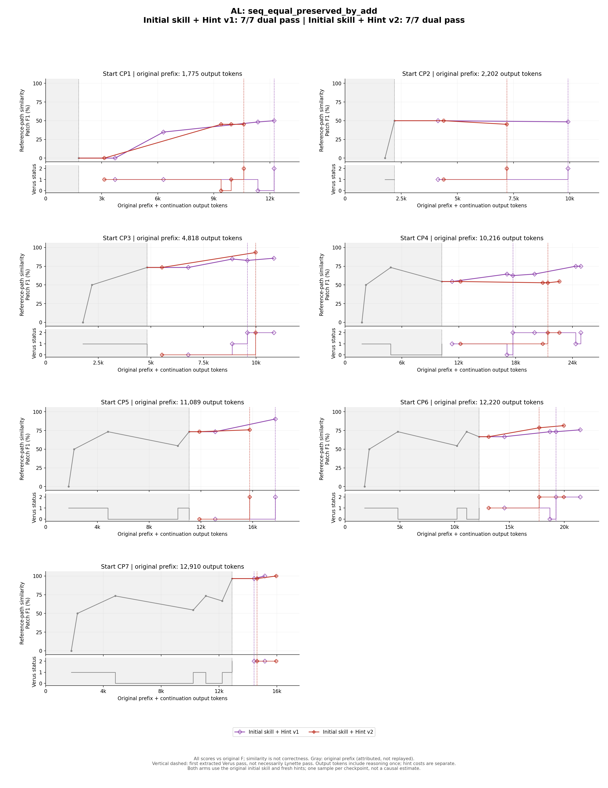

# AL：Initial skill + Hint v1 / v2 逐checkpoint对照

[今日完整hint内容核对及AC审计纠错](../HINT_CONTENT_COMPARISON.md)。完整hint原文是判断提示覆盖范围的依据，不能只取首段。


[原trace＋两版增广：去重后的信息增量审计](../INFORMATION_VALUE_AUDIT.md)。有效材料包括可解释的失败；成功率不等于新增信息量。


本题两组各7条续跑，均装备与原trace相同的initial skill，模型为DeepSeek v4 Pro，checkpoint提取与续跑条件一致。**v1/v2的hint模板不同，每个checkpoint的hint也分别重新生成，没有共用hint。** 两版对应起点的实际hint全文均不相同；文字不同不等于数学策略不同，具体以每点审计为准。

v1要求诊断当前缺口并给出逻辑提示；v2在此基础上要求另行检查有证据支持的结构兼容风险，区分已观察到的Lynette失败、潜在风险和无证据风险，不能泛称所有导入都会失败。两版保持简短逻辑指导，不提供整段最终proof。这里的v1/v2是prompt版本；JSON里的`schema_version: hint-v1`是共用数据格式标识，不代表两版提示内容相同。

[Hint v1模板](../prompts/v1/hint_system.md) · [Hint v2模板](../prompts/v2/hint_system.md) · [原v1详细报告](v1/REPORT.md) · [原v2详细报告](v2/REPORT.md)

| 版本 | 最终Verus＋Lynette通过 | Actor输出token合计 |
|---|---:|---:|
| v1 | 7/7 | 65,299 |
| v2 | 7/7 | 54,141 |

每点只各跑一次，模板版本和生成内容同时变化；同起点对照能描述采纳、失败和成本差异，不能证明哪个提示稳定更优。旧blank组未混入此对照。



横轴为原前缀归属token＋续跑actor输出token；原前缀未实际回放，hint生成成本另计。上图Patch F1是相对原F的参考路径相似度，不是正确性评分；下图为Verus状态，首次Verus通过不等于最终Lynette也通过。

## 先读懂原题与原F

目标为`s1 == s2 <==> s1 + suffix == s2 + suffix`。正向只需等式替换；逆向不能直接从拼接相等跳到前缀相等，原F补了两个桥梁：由拼接长度相等消去共同suffix长度，得到s1、s2等长；然后对前缀范围内的i，用拼接索引定律把两侧元素还原为s1[i]与s2[i]，最后用序列外延性。

CP1为空proof，CP2逆向缺事实，CP3使用不可解析的引理，CP4长度／索引桥接未补全，CP5改猜对象方法仍失败，CP6外延宏内缺逐点事实，CP7数学已通过。宏、局部broadcast和显式forall是表达该路线的不同方式，不应仅凭源码不同称作新数学策略。额外顶层导入可能不影响Verus证明，却影响本实验Lynette的结构比较。

[原题源码](original_input.rs) · [原F全文](original_final.rs)

<a id="cp1"></a>
## CP1：同一起点，两版如何处理

**直接对照。** v2没有该错误逆向分支，但仍先写错broadcast名称及量词前提形式。两版都需区分数学路线正确与具体实现正确。

| 版本 | Actor输出token | 源码变化次数 | 最终双通过 |
|---|---:|---:|---|
| v1 | 11,474 | 3 | 通过 |
| v2 | 9,994 | 3 | 通过 |

<a id="v1-cp1"></a>
### v1：方向正确，但首个分支写出错误断言

**客观起点（原trace事件21）。** 空proof，需证明加同一suffix保持且反映序列相等。

**Hint作何判断。** 长度消去、合法前缀索引相等、外延性是正确逆向证明路线。

**实际编辑与验证顺序。** 32在s1!=s2分支无相应假设直接断言拼接相等及s1==s2；34失败。40改为在拼接相等假设下证明长度和逐点相等，但调用不存在的ext_equal方法；42 E0599。48删错误方法，50／55双通过。

**为什么这些修改有效，或仍然失败。** s1!=s2并不推出两者拼接相等，更不推出s1==s2。最初逆向分支缺少“拼接相等”的假设，直接写这些assert是错误尝试，不能称作提前列出若干正确事实。事件40改为在真正逆向前提下做长度消去和索引推理，逻辑才接回原目标。随后ext_equal是不存在的方法，删除它后已有事实足以由验证器闭合目标。

事件32的实际错误分支如下（保留原代码，不是建议写法）：

```rust
    } else {
        assert(s1 + suffix == s2 + suffix) by {
            // Backward direction is not yet established; keep this branch explicit
            // so the verifier reports the remaining subgoal.
        }
        assert(s1 == s2);
    }
```

这里else继承的是`s1 != s2`。注释把它称为暴露剩余子目标，但断言并非由该分支前提推出；事件34实际报错。事件40改成独立的`if s1 + suffix == s2 + suffix`后才回到正确逆向前提。这是源码与自述不一致的明确例子，训练时以代码／诊断为准。

**Hint究竟起了什么作用。** hint给出的逆向链本来正确，错误分支和猜API由actor生成，不是提示要求。提示至少在后续修复中被采用；但不能用最终通过为最早无依据断言背书。

**同起点两版对照。** v2没有该错误逆向分支，但仍先写错broadcast名称及量词前提形式。两版都需区分数学路线正确与具体实现正确。 见[另一版CP1](v2/REPORT.md#cp1)。

**语义审计结论。** 最终逻辑成立，但事件32不能解释成合理的“分阶段证明”：它是错误中间尝试。可保留真实纠错轨迹，禁止把该失败断言抽成有效推理步骤。

**最终检查边界。** 宿主Verus=通过，Lynette=通过；该结论对应链接中的最终candidate hash，不用中途通过替代终点检查。

<details><summary>本次实际发送的hint全文</summary>

Current failure is an unproved postcondition in an empty body. The target is an equivalence, so the next objective is to prove the two implications separately. For the forward direction, if s1 == s2, append the same suffix to both sides and close the concatenation equality by congruence. The backward direction is the real gap: from s1 + suffix == s2 + suffix, do not immediately assert s1 == s2; that fails. Instead derive equality stepwise. First use equality of the concatenations to obtain equal lengths, then reason from the length behavior of sequence append to conclude s1.len() == s2.len(). Then prove extensional equality of s1 and s2: for any index in s1's range, the corresponding concatenated indices are equal by assumption, and because the index is below s1.len(), those values reduce to s1[i] and s2[i]. Equal lengths plus pointwise equality should close sequence equality. Run Verus after establishing each direction to identify the remaining subgoal.

</details>

[起点源码](checkpoints/CP01.rs) · [hint原文件](v1/CP01/hint.json) · [全部修改与工具反馈](v1/CP01/PROCESS.md) · [最终源码](v1/CP01/final.rs) · [最终验证](v1/CP01/result.json)


<a id="v2-cp1"></a>
### v2：无额外导入，仍有API与前提返工

**客观起点（原trace事件21）。** 空proof。

**Hint作何判断。** 正确给出长度消去与逐点相等，当前未观察到结构差异。

**实际编辑与验证顺序。** 59补主体但broadcast组未限定且forall用==>；61解析失败；67限定组，69索引断言失败；75改implies，77／82双通过。

**为什么这些修改有效，或仍然失败。** 第一次主体采用了正确双向分解，却同时引入名称和前提实现错误。限定broadcast后，索引断言才被真正检查；将forall的==>改为implies，让“i在前缀范围”进入证明块，才能合法使用拼接索引关系。这说明报错层级推进不等于每个阶段都已证明正确。

**Hint究竟起了什么作用。** 数学主线与hint一致，但hint没让actor一次写对API和量词。未新增顶层导入是本次事实，不能进一步声称新提示能普遍阻止所有兼容问题。

**同起点两版对照。** v1最初还写了错误逆向断言，v2没有；两者均为最终成功的纠错过程，而不是每一步都正确的演绎稿。 见[另一版CP1](v1/REPORT.md#cp1)。

**语义审计结论。** 最终符合数学路线；v2没有消除名称和前提错误，但没有本轮v1 CP1的无依据逆向断言。

**最终检查边界。** 宿主Verus=通过，Lynette=通过；该结论对应链接中的最终candidate hash，不用中途通过替代终点检查。

<details><summary>本次实际发送的hint全文</summary>

The empty proof body gives Verus nothing to establish the biconditional, so the postcondition is completely unproved. Split the proof into two implications. Forward: from s1 == s2, derive equality of s1 + suffix and s2 + suffix by congruence, since appending the same suffix preserves equality. Backward: start from s1 + suffix == s2 + suffix. First derive equal concatenation lengths, use the fact that concatenation length is the sum of component lengths, cancel suffix length, and obtain s1.len() == s2.len(). Then show the prefixes agree pointwise: for every index in s1's range, relate indexing into a concatenation at an index below the first sequence's length to indexing into the first sequence, so equality of the concatenations yields equality of corresponding prefix elements. Finish by sequence extensionality: equal lengths plus pointwise equality imply s1 == s2. Run Verus after the edit; the backward direction should fail if length cancellation or prefix index unfolding is missing. This checkpoint has no structural difference from input.rs requiring a separate compatibility fix.

</details>

[起点源码](checkpoints/CP01.rs) · [hint原文件](v2/CP01/hint.json) · [全部修改与工具反馈](v2/CP01/PROCESS.md) · [最终源码](v2/CP01/final.rs) · [最终验证](v2/CP01/result.json)

<a id="cp2"></a>
## CP2：同一起点，两版如何处理

**直接对照。** v2也一次补全同类事实；两版没有实质数学策略差异。

| 版本 | Actor输出token | 源码变化次数 | 最终双通过 |
|---|---:|---:|---|
| v1 | 8,816 | 1 | 通过 |
| v2 | 5,967 | 1 | 通过 |

<a id="v1-cp2"></a>
### v1：一次补齐逆向事实

**客观起点（原trace事件28）。** 正向已可证明，逆向直接断言序列相等失败。

**Hint作何判断。** 准确要求先等长、再逐索引相等。

**实际编辑与验证顺序。** 66补长度／索引推理及proof局部broadcast use vstd::seq::group_seq_axioms；68／73双通过。

**为什么这些修改有效，或仍然失败。** 仅知道两个拼接序列相等时，必须先确保前缀长度相同，才能将同一i同时视作两边的合法前缀索引。补入长度等式完成这一步，再用拼接索引性质获得逐点相等，最后外延性才能收尾。局部broadcast激活相关库事实，没有改写目标规格。

**Hint究竟起了什么作用。** 长度和索引两项提示都得到明确代码对应，没有见到改规格或增加未经证明的假设。值得保留的是事实依赖链，而不只是“最后通过”这条标签。

**同起点两版对照。** v2也一次补全同类事实；两版没有实质数学策略差异。 见[另一版CP2](v2/REPORT.md#cp2)。

**语义审计结论。** 清楚的缺失事实→补足→验证样本。局部broadcast不等于改变顶层导入；检索时间不应从成本中忽略。

**最终检查边界。** 宿主Verus=通过，Lynette=通过；该结论对应链接中的最终candidate hash，不用中途通过替代终点检查。

<details><summary>本次实际发送的hint全文</summary>

The current failure is the backward direction of the biconditional: under the assumption that s1 + suffix == s2 + suffix, the direct assertion s1 == s2 is too strong for Verus to derive automatically. The next proof objective is to establish the two facts needed for sequence equality of s1 and s2: equal lengths and matching elements at every valid prefix index. From equality of the concatenated sequences, first derive equality of their lengths, then unwind the length relationship of sequence concatenation to conclude that s1.len() and s2.len() agree. After that, for an arbitrary index i in the prefix range, use the equality of the concatenations at i and the fact that indexing a concatenation before the boundary of the left operand selects the left operand's element. This gives pointwise equality on the prefixes, after which sequence extensionality should close the goal. Re-run Verus after this reasoning; the diagnostic should progress from the failed assertion to any remaining unfoldings before Lynette is checked.

</details>

[起点源码](checkpoints/CP02.rs) · [hint原文件](v1/CP02/hint.json) · [全部修改与工具反馈](v1/CP02/PROCESS.md) · [最终源码](v1/CP02/final.rs) · [最终验证](v1/CP02/result.json)


<a id="v2-cp2"></a>
### v2：一次补齐逆向证明

**客观起点（原trace事件28）。** 逆向缺等长和前缀逐点事实。

**Hint作何判断。** 数学诊断准确，没有要求具体可复制proof。

**实际编辑与验证顺序。** 32补拼接长度消去、forall implies下的索引关系及外延结论；34／39双通过。

**为什么这些修改有效，或仍然失败。** 本次直接补上“等长→同一索引两侧有效→元素相等”的桥梁。implies保证索引范围前提在proof块内可用，不需额外假设；外延结论依赖这两类事实而非直接照写目标。

**Hint究竟起了什么作用。** hint的两项证明义务都得到代码落实，且第一次修改后双通过。可以作为紧凑但逻辑完整的展开，不应因为只有一次修改就判为跳步。

**同起点两版对照。** v1同点也是一次修复，仅具体库事实激活形式不同；没有证据认定为两种不同数学策略。 见[另一版CP2](v1/REPORT.md#cp2)。

**语义审计结论。** 直接采纳，合理展开；两版均一次源码修复。

**最终检查边界。** 宿主Verus=通过，Lynette=通过；该结论对应链接中的最终candidate hash，不用中途通过替代终点检查。

<details><summary>本次实际发送的hint全文</summary>

The forward direction is already accepted. The remaining gap is the backward direction: from equality of the concatenated sequences, Verus cannot directly conclude s1 == s2 by a raw equality assertion. Prove sequence equality by extensionality instead. First establish that s1 and s2 have equal lengths by combining the fact that equal sequences have equal length with the relation between a concatenation length and the lengths of its parts, then cancel the common suffix length. Next, for an arbitrary valid index i of s1, show s1[i] == s2[i]. The equal concatenated sequences have equal values at i, and because i is within the prefix length, each concatenation's value at i reduces to the corresponding prefix element. With equal lengths and pointwise equality for all valid indices, conclude sequence equality via extensionality. Re-run Verus; the previous raw equality failure should be replaced by verification success or by a more local length/index failure rather than the original assertion failure. Keep the function signature and specification unchanged.

</details>

[起点源码](checkpoints/CP02.rs) · [hint原文件](v2/CP02/hint.json) · [全部修改与工具反馈](v2/CP02/PROCESS.md) · [最终源码](v2/CP02/final.rs) · [最终验证](v2/CP02/result.json)

<a id="cp3"></a>
## CP3：同一起点，两版如何处理

**直接对照。** v2把去调用、补事实和删导入一次做完，本点是可观察到修复组织改善的配对案例。

| 版本 | Actor输出token | 源码变化次数 | 最终双通过 |
|---|---:|---:|---|
| v1 | 6,950 | 3 | 通过 |
| v2 | 6,053 | 1 | 通过 |

<a id="v1-cp3"></a>
### v1：先去错调用，再补事实，再清导入

**客观起点（原trace事件36）。** lemma_seq_add_len/index解析失败，起点含导入。

**Hint作何判断。** 建议不用猜测API，以长度及索引基本事实完成。

**实际编辑与验证顺序。** 39只删不可用调用，41长度断言失败；47补长度展开，49 Verus；54 Lynette失败；60删导入，62／66双通过。

**为什么这些修改有效，或仍然失败。** 删除不可解析调用只消除了编译障碍，不会凭空产生原来希望那些调用提供的拼接事实。因此第一次删调用后长度断言仍失败是合理诊断，下一轮显式长度展开才补上实际证明缺口。最后删导入处理结构要求，与长度论证本身无关。

**Hint究竟起了什么作用。** actor接受了不用猜测API的方向，但第一次只做“去掉错误语句”，没有同时补其数学职责；之后才补全，提示落实延迟。hint没有让此点提前规避导入失败。

**同起点两版对照。** v2把去调用、补事实和删导入一次做完，本点是可观察到修复组织改善的配对案例。 见[另一版CP3](v2/REPORT.md#cp3)。

**语义审计结论。** 数学建议有效但未一次落实，兼容未预防。API解析失败不能泛化成任何环境都没有同名引理。

**最终检查边界。** 宿主Verus=通过，Lynette=通过；该结论对应链接中的最终candidate hash，不用中途通过替代终点检查。

<details><summary>本次实际发送的hint全文</summary>

The Verus diagnostic is a name-resolution failure: the proof calls two guessed vstd::seq_lib lemmas for concatenation length and indexing, but those names do not exist. Do not hunt for similarly named helpers. In the branch where s1 + suffix == s2 + suffix, prove the needed facts directly from sequence concatenation. First derive s1.len() == s2.len(): equality of the concatenated sequences gives equal lengths, and concatenation length is the sum of component lengths. Then prove pointwise prefix equality: for any valid index i < s1.len(), the equality of the concatenated sequences gives equal values at i, and concatenation indexing gives those values as s1[i] and s2[i]. Equal lengths plus pointwise equality support extensional equality s1 == s2. Remove the unresolved helper calls, re-run Verus, and use any remaining assertion failure to identify whether those concatenation facts need a more explicit proof or available library statement.

</details>

[起点源码](checkpoints/CP03.rs) · [hint原文件](v1/CP03/hint.json) · [全部修改与工具反馈](v1/CP03/PROCESS.md) · [最终源码](v1/CP03/final.rs) · [最终验证](v1/CP03/result.json)


<a id="v2-cp3"></a>
### v2：一次去错调用、补证明并删导入

**客观起点（原trace事件36）。** 不可用lemma调用阻塞解析。

**Hint作何判断。** 建议真实拼接事实替代猜测API，并清理无用导入。

**实际编辑与验证顺序。** 35一次删除错误调用与导入，补长度和索引证明；37／42双通过。

**为什么这些修改有效，或仍然失败。** 一次编辑承担三件有区别的事：去掉当前接口不可用的调用；用显式长度／索引事实补回其预期证明作用；去掉多余导入以满足提交结构。只做第一项是不够的，本次三项同时完成，之后直接双通过。

**Hint究竟起了什么作用。** 与hint内容有较强的一一对应，既解决当前名称错误，也没有重现后续缺事实和导入失败。不过“该调用在此环境不可用”不应扩大为所有版本都没有这类引理。

**同起点两版对照。** v1同点先删调用、再补长度、最后删导入；本点支持观察到更完整的一次修复，但尚不能分离fresh hint与actor采样的贡献。 见[另一版CP3](v1/REPORT.md#cp3)。

**语义审计结论。** 比本轮v1减少分层失败，代码证据支持提示被落实；单样本不能证明prompt的因果收益。

**最终检查边界。** 宿主Verus=通过，Lynette=通过；该结论对应链接中的最终candidate hash，不用中途通过替代终点检查。

<details><summary>本次实际发送的hint全文</summary>

Verus is currently blocked before proof verification by unresolved helper names: the calls for concatenation length and concatenation indexing are not present in this version's vstd::seq_lib. Do not keep guessing alternate helper names. Establish the needed mathematics directly: equality of the concatenations implies their lengths are equal, which yields equal lengths for s1 and s2; and for any index within the first operand's range, the concatenation at that index equals the corresponding prefix element. Use those facts to prove pointwise equality of s1 and s2, then close by sequence extensionality. Re-run Verus to confirm the name-resolution errors disappear and any remaining diagnostic is a proof obligation rather than API misuse. The added vstd::seq_lib import is not in the original input and may become unused after removing those calls; run Lynette afterward, but do not assume the import itself caused a compatibility failure without a Lynette diagnostic.

</details>

[起点源码](checkpoints/CP03.rs) · [hint原文件](v2/CP03/hint.json) · [全部修改与工具反馈](v2/CP03/PROCESS.md) · [最终源码](v2/CP03/final.rs) · [最终验证](v2/CP03/result.json)

<a id="cp4"></a>
## CP4：同一起点，两版如何处理

**直接对照。** v2仍有==>和导入返工，但未经历v1新增导入再逐个删掉的长链；相同数学路线的实现效率有所不同。

| 版本 | Actor输出token | 源码变化次数 | 最终双通过 |
|---|---:|---:|---|
| v1 | 15,920 | 5 | 通过 |
| v2 | 13,508 | 3 | 通过 |

<a id="v1-cp4"></a>
### v1：数学路线保留，实现上多次返工

**客观起点（原trace事件48）。** 长度桥接与外延宏证明未完成，另有导入。

**Hint作何判断。** 长度／逐点目标正确；“不用宏”的倾向不是必要数学限制，宏在事实齐备时可用。

**实际编辑与验证顺序。**

| 编辑／检查事件 | 修改意图 | 实际反馈与解释 |
|---|---|---|
| 46／48 | 补长度与宏内索引，激活broadcast组 | 组名不可解析，数学主体尚未通过检查 |
| 54／56／61 | 用顶层导入解决组名 | Verus通过，但Lynette报差异；名称可见与结构允许是两回事 |
| 76／78／82 | 改限定组名并删新增导入 | Verus通过，Lynette仍失败；另一个原有seq_lib导入未删 |
| 107／109 | 删剩余导入，宏改显式forall | 引入==>前提上下文问题，索引证明失败 |
| 115／117／121 | 将该量词改为implies | 前提进入证明体，Verus与Lynette最终都通过 |

**为什么这些修改有效，或仍然失败。** 第一次证明构造本身沿用长度和索引路线，但未限定broadcast组导致名称失败。用顶层导入救活名称后，Verus通过却Lynette失败；移除一条导入仍失败，因为原seq_lib导入还在。随后改写宏为forall时又使用==>，前提没进入proof体，引出新的索引问题。最终implies修复的是该局部上下文，不是新增序列数学定理。

**Hint究竟起了什么作用。** hint数学目标可行，却没有约束住名称／导入的反复试错。它对宏的偏好不应被当成“宏路线不合法”的结论；本题宏和forall都能表达正确外延证明。

**同起点两版对照。** v2仍有==>和导入返工，但未经历v1新增导入再逐个删掉的长链；相同数学路线的实现效率有所不同。 见[另一版CP4](v2/REPORT.md#cp4)。

**语义审计结论。** 不存在顺畅的一次修复；失败都有实际源码和反馈。最终长度＋逐点路线成立，错误API、导入和前提写法不能作为正知识。

**最终检查边界。** 宿主Verus=通过，Lynette=通过；该结论对应链接中的最终candidate hash，不用中途通过替代终点检查。

<details><summary>本次实际发送的hint全文</summary>

The backward direction is failing because after assuming the concatenations are equal, Verus has not derived either length equality or pointwise prefix equality. The sequence-equality macro cannot close until those facts are available. Next objective: derive len(s1) == len(s2). Equality of the concatenated sequences gives equality of their lengths; express each concatenated length as a sum and cancel the common len(suffix). Then prove the prefixes agree pointwise: for an arbitrary valid index i of s1, compare the concatenated sequences at i and use the concatenation index property on each side to reduce this to s1[i] == s2[i]. Finally close with sequence extensionality rather than the macro. Check by rerunning Verus: the length assertion should pass, and the pointwise/extensionality step should establish the backward implication. If an index-unfolding assertion fails, expose that concatenation index fact before using it in the pointwise proof.

</details>

[起点源码](checkpoints/CP04.rs) · [hint原文件](v1/CP04/hint.json) · [全部修改与工具反馈](v1/CP04/PROCESS.md) · [最终源码](v1/CP04/final.rs) · [最终验证](v1/CP04/result.json)


<a id="v2-cp4"></a>
### v2：前提修复后才处理导入

**客观起点（原trace事件48）。** 长度桥接、索引推理未完成，起点有导入。

**Hint作何判断。** 数学目标及导入兼容提醒正确。

**实际编辑与验证顺序。** 69补长度与forall ==>，71索引失败；77改implies，79 Verus；84 Lynette失败；90删导入，92／96双通过。

**为什么这些修改有效，或仍然失败。** actor已按数学提示补长度和逐点证明，却使用==>让索引范围未成为proof体假设；改implies后数学通过，说明核心缺口是前提传递而非需要新的序列定理。之后Lynette才要求删顶层导入，证明这条兼容提醒并未提前落实。

**Hint究竟起了什么作用。** 提示同时涉及数学及兼容，但执行结果是分阶段修复而非预防失败。“最终照做了”与“提前规避了”是两个不同结论，此点只支持前者。

**同起点两版对照。** v1多出broadcast名称和两轮导入修复；v2过程较短，但仍有实际前提错误和一次Lynette失败。 见[另一版CP4](v1/REPORT.md#cp4)。

**语义审计结论。** 数学／兼容均最终落实，提醒没有提前规避所有错误。

**最终检查边界。** 宿主Verus=通过，Lynette=通过；该结论对应链接中的最终candidate hash，不用中途通过替代终点检查。

<details><summary>本次实际发送的hint全文</summary>

In the backward direction, start from the concatenation equality and derive that the concatenated values have the same length. Then unfold the length of each concatenation into prefix length plus suffix length, cancel the common suffix length, and only then conclude the prefix lengths are equal. The current first failure arises because this length argument is skipped. Next, prove the prefixes agree pointwise: for an arbitrary prefix index, compare the concatenated values at that index and unfold both concatenation index accesses to reduce them to the corresponding prefix elements. After that, close under sequence extensionality. The sequence-library equality macro cannot supply these missing index-shift and length facts, so establish them before invoking it or switch to explicit extensionality. Re-run Verus and expect the remaining failures to resolve. Compatibility note: this state adds a sequence-library import relative to the input; if it becomes unused after restructuring, remove it before the final Lynette check, but no Lynette failure is observed for the current state.

</details>

[起点源码](checkpoints/CP04.rs) · [hint原文件](v2/CP04/hint.json) · [全部修改与工具反馈](v2/CP04/PROCESS.md) · [最终源码](v2/CP04/final.rs) · [最终验证](v2/CP04/result.json)

<a id="cp5"></a>
## CP5：同一起点，两版如何处理

**直接对照。** v2也是一次同类修复；两版差别不足以支持“新解法”，更适合作重复可行的修复模式。

| 版本 | Actor输出token | 源码变化次数 | 最终双通过 |
|---|---:|---:|---|
| v1 | 8,039 | 1 | 通过 |
| v2 | 5,575 | 1 | 通过 |

<a id="v1-cp5"></a>
### v1：数学与导入一次修好

**客观起点（原trace事件55）。** Seq对象方法调用不可用，长度／索引桥接待补。

**Hint作何判断。** 建议直接用拼接事实，并删除不再使用的导入。

**实际编辑与验证顺序。** 54删除错误方法和导入，补长度与索引事实；56／61双通过。

**为什么这些修改有效，或仍然失败。** 不可用对象方法原本想提供长度与索引事实。事件54用显式拼接等式替代这些调用，使逆向证明先确定前缀长度，再在合法索引上建立元素相同；一并去掉不再需要的导入避免提交结构差异。这里没有通过删掉证明责任来取得通过。

**Hint究竟起了什么作用。** 数学替代和兼容清理都与hint对应，之后直接双通过，是本版较清楚的采纳样例。仍只能说明本次行为对应，而非证明每次同提示都如此。

**同起点两版对照。** v2也是一次同类修复；两版差别不足以支持“新解法”，更适合作重复可行的修复模式。 见[另一版CP5](v2/REPORT.md#cp5)。

**语义审计结论。** 本题直接采纳提示的清晰成功项，仍是原证明的同类数学路线。

**最终检查边界。** 宿主Verus=通过，Lynette=通过；该结论对应链接中的最终candidate hash，不用中途通过替代终点检查。

<details><summary>本次实际发送的hint全文</summary>

The current failure is a method-resolution problem, not a missing proof obligation: the guessed Seq helpers for concatenation length/index do not exist in this vstd version. Replace that approach by using the built-in facts about Seq concatenation directly. The mathematical facts needed are that concatenation length is the sum of component lengths, and for an index below the prefix length, the concatenated value equals the prefix value at that index. In the backward direction, first derive equal lengths from the assumed equality of concatenated sequences, then decompose the lengths to conclude the prefixes have equal length. Then prove pointwise equality for each valid index by exposing the prefix-index simplification on both sides and matching them through the concatenation equality. Finally close with sequence extensionality. Remove the now-unnecessary seq_lib import if no library helpers remain. Re-run Verus: success should first eliminate the E0599 method errors, then verify the postcondition.

</details>

[起点源码](checkpoints/CP05.rs) · [hint原文件](v1/CP05/hint.json) · [全部修改与工具反馈](v1/CP05/PROCESS.md) · [最终源码](v1/CP05/final.rs) · [最终验证](v1/CP05/result.json)


<a id="v2-cp5"></a>
### v2：一次替换不可用方法

**客观起点（原trace事件55）。** 方法解析失败；目标需长度消去和索引相等。

**Hint作何判断。** 数学诊断正确；“当前仅unused-import warning”的措辞应与原诊断分开，不能由导入未使用就推定Verus已经报告该warning。

**实际编辑与验证顺序。** 22去错误方法与导入，补长度、两侧合法索引及逐点事实；24／29双通过。

**为什么这些修改有效，或仍然失败。** 去掉对象方法以后，显式长度消去确保s1和s2索引范围一致，再用拼接索引等式取得逐点相同；因此替换不是把失败调用删掉就宣称目标成立。导入也同轮删除，第一次修改后双通过。

**Hint究竟起了什么作用。** 数学建议准确且被执行。hint把导入描述成“当前unused-import warning”应有实际诊断支持；即使导入确实多余，也不能把自然语言措辞当作Verus已输出该warning的证据。

**同起点两版对照。** v1也是一次合并修复，两版数学核心相同；本次主要体现修复模式能再次被执行，而非新策略。 见[另一版CP5](v1/REPORT.md#cp5)。

**语义审计结论。** 直接成功。保留有效数学指导；hint关于warning的说法不作为工具事实或训练知识。

**最终检查边界。** 宿主Verus=通过，Lynette=通过；该结论对应链接中的最终candidate hash，不用中途通过替代终点检查。

<details><summary>本次实际发送的hint全文</summary>

The checkpoint currently fails at name resolution, not at the target logical obligation: the calls to lemma_seq_add_len and lemma_seq_add_index are not available in this Verus version, so no proof progress is being made. Instead proceed directly with the built-in concatenation facts: under the hypothesis that s1 + suffix equals s2 + suffix, first obtain that their lengths are equal and that the length of a concatenation is the sum of component lengths, hence s1 and s2 have equal length. Then, for any index i in the prefix range, use the fact that indexing the concatenation at i yields the original prefix element for both sides; this gives pointwise equality of s1 and s2. Close by sequence extensionality. After removing the nonexistent lemma calls, rerun Verus; success would be 1 verified, 0 errors. The extra seq_lib import is currently only an unused-import warning in Verus, but remove it once it is no longer used and run Lynette on the cleaned candidate rather than assuming it is safe.

</details>

[起点源码](checkpoints/CP05.rs) · [hint原文件](v2/CP05/hint.json) · [全部修改与工具反馈](v2/CP05/PROCESS.md) · [最终源码](v2/CP05/final.rs) · [最终验证](v2/CP05/result.json)

<a id="cp6"></a>
## CP6：同一起点，两版如何处理

**直接对照。** v2无本轮v1的broadcast名称错误，但仍数学通过后才处理导入；二者并非兼容问题都被彻底解决。

| 版本 | Actor输出token | 源码变化次数 | 最终双通过 |
|---|---:|---:|---|
| v1 | 10,382 | 3 | 通过 |
| v2 | 8,819 | 2 | 通过 |

<a id="v1-cp6"></a>
### v1：证明补好后处理两层名称问题

**客观起点（原trace事件62）。** 外延宏内尚缺拼接索引事实，起点有导入。

**Hint作何判断。** 提示补逐点关系；没有使actor避免后续名称／导入问题。

**实际编辑与验证顺序。** 55补宏内索引证明但broadcast未限定，57解析失败；63限定broadcast，65 Verus；70 Lynette失败；76删导入并限定宏，78／82双通过。

**为什么这些修改有效，或仍然失败。** 序列相等宏不会自动知道拼接前缀索引定律：补宏内逐点事实才填上数学空缺。未限定broadcast与顶层导入是随后两个独立实现问题；前者修后Verus已过，后者只有Lynette暴露，最后限定宏保留相同论证。

**Hint究竟起了什么作用。** hint在数学层有可见作用，但没有避免actor使用错误名称，也没让它在第一次编辑时清理导入。不能把后续全部返工描述成有益证明展开。

**同起点两版对照。** v2无本轮v1的broadcast名称错误，但仍数学通过后才处理导入；二者并非兼容问题都被彻底解决。 见[另一版CP6](v2/REPORT.md#cp6)。

**语义审计结论。** 核心数学修复有效，工具兼容延迟处理。

**最终检查边界。** 宿主Verus=通过，Lynette=通过；该结论对应链接中的最终candidate hash，不用中途通过替代终点检查。

<details><summary>本次实际发送的hint全文</summary>

Verus now fails only at the sequence-equality macro for s1 and s2. The length reasoning is no longer the problem, but the macro cannot derive pointwise equality from the concatenation equality by itself. Next objective: in the branch where s1 + suffix == s2 + suffix, prove that for every valid prefix index i, s1[i] == s2[i]. Use the assumed equality of the concatenated sequences at that same i, then unfold the meaning of concatenation indexing in the prefix range so that (s1 + suffix)[i] is s1[i] and (s2 + suffix)[i] is s2[i]. Once length equality and this pointwise prefix equality are available, close by sequence extensionality rather than relying only on the macro. Re-run Verus: a successful edit should eliminate the macro failure and report 1 verified, 0 errors, possibly with only an unused-import warning.

</details>

[起点源码](checkpoints/CP06.rs) · [hint原文件](v1/CP06/hint.json) · [全部修改与工具反馈](v1/CP06/PROCESS.md) · [最终源码](v1/CP06/final.rs) · [最终验证](v1/CP06/result.json)


<a id="v2-cp6"></a>
### v2：数学先通过，导入仍后修

**客观起点（原trace事件62）。** 宏内缺逐点事实，已有顶层宏导入。

**Hint作何判断。** 提示数学补足；“不再使用时才删导入”的兼容建议偏窄，仍使用宏也可改限定路径。

**实际编辑与验证顺序。** 42补宏内索引，44 Verus；49 Lynette失败；59删导入并限定宏，61／65双通过。

**为什么这些修改有效，或仍然失败。** 宏内补索引事实解决了数学义务，但宏仍通过顶层导入获得名称，所以Verus通过后结构检查依旧可能失败。删导入不意味着禁用宏，改全限定宏即可保留整段证明。这正是“没用的导入才删”表述不足以覆盖的情况。

**Hint究竟起了什么作用。** hint有实际数学指导，但兼容建议边界较窄；actor最终在Lynette反馈后完成路径修复。不能把这次失败解释成actor完全无视所有hint，也不能声称hint提前避免了它。

**同起点两版对照。** v1先多一轮broadcast名称错误；v2少了那一层，宏导入问题仍一样存在。 见[另一版CP6](v1/REPORT.md#cp6)。

**语义审计结论。** 兼容风险没有被提前解决；最终修复合理，不是hint导致全程无失败。

**最终检查边界。** 宿主Verus=通过，Lynette=通过；该结论对应链接中的最终candidate hash，不用中途通过替代终点检查。

<details><summary>本次实际发送的hint全文</summary>

The current failure is no longer about lengths: the length assertions before line 19 are accepted, but the macro cannot close sequence equality because it lacks the pointwise fact that s1[i] == s2[i] for every prefix index i. Next prove that for every i with 0 <= i < s1.len(), the two prefixes agree at i. From the branch hypothesis s1 + suffix == s2 + suffix, you can compare the concatenated sequences at index i; since i lies in the prefix range, the concatenation at i equals the corresponding prefix element for both s1 and s2. Then use sequence extensionality to conclude s1 == s2 from that pointwise equality. Re-run Verus and expect the macro failure to disappear. If the new proof no longer uses the seq_lib import, clean it up before Lynette; the final validated state has no such extra import, but there is no recorded Lynette result for the current import-bearing state.

</details>

[起点源码](checkpoints/CP06.rs) · [hint原文件](v2/CP06/hint.json) · [全部修改与工具反馈](v2/CP06/PROCESS.md) · [最终源码](v2/CP06/final.rs) · [最终验证](v2/CP06/result.json)

<a id="cp7"></a>
## CP7：同一起点，两版如何处理

**直接对照。** v2先实际运行Lynette确认差异再删导入；最终修复内容相同，诊断顺序不同。

| 版本 | Actor输出token | 源码变化次数 | 最终双通过 |
|---|---:|---:|---|
| v1 | 3,718 | 1 | 通过 |
| v2 | 4,225 | 1 | 通过 |

<a id="v1-cp7"></a>
### v1：删除多余导入

**客观起点（原trace事件69）。** 起点数学已通过，只剩可能的结构差异。

**Hint作何判断。** 建议清理unused导入后检查Lynette。

**实际编辑与验证顺序。** 19确认Verus，25删除导入，27／32双通过；本次未先复现Lynette失败。

**为什么这些修改有效，或仍然失败。** 本点已有长度、合法索引和外延性完整链，删导入不改变该链。actor先确认Verus，然后按提示改结构并通过Lynette；本次没有先测出Lynette失败，所以不能把原轨迹中的失败事件冒充本轮实际事件。

**Hint究竟起了什么作用。** hint作用是约束修复范围，避免对已经正确的数学继续动手。它可能节省无关重写，但没有无hint配对重复实验来量化该因果效应。

**同起点两版对照。** v2先实际运行Lynette确认差异再删导入；最终修复内容相同，诊断顺序不同。 见[另一版CP7](v2/REPORT.md#cp7)。

**语义审计结论。** 只做兼容清理，不计作新的数学解法。

**最终检查边界。** 宿主Verus=通过，Lynette=通过；该结论对应链接中的最终candidate hash，不用中途通过替代终点检查。

<details><summary>本次实际发送的hint全文</summary>

The mathematical proof in this checkpoint is already accepted by Verus: the recorded run reports 1 verified, 0 errors. Do not add more sequence reasoning unless a later check exposes a new failure. The remaining issue is a warning for an unused `vstd::seq_lib` import. Remove that unused import since the current proof does not call any `seq_lib` helpers; then rerun Verus and confirm clean verification. Also run the Lynette comparison, because Verus success alone does not establish proof-only safety/spec preservation. If Lynette reports a mismatch, classify its diagnostic before changing the proof.

</details>

[起点源码](checkpoints/CP07.rs) · [hint原文件](v1/CP07/hint.json) · [全部修改与工具反馈](v1/CP07/PROCESS.md) · [最终源码](v1/CP07/final.rs) · [最终验证](v1/CP07/result.json)


<a id="v2-cp7"></a>
### v2：主动复现结构错误后清理

**客观起点（原trace事件69）。** 起点数学正确。

**Hint作何判断。** 提醒验证结构差异，不要求另造数学证明。

**实际编辑与验证顺序。** 20 Verus通过，24 Lynette失败；31删除导入，33／37双通过。

**为什么这些修改有效，或仍然失败。** 这里没有还没证明的长度或索引事实。actor先对同一候选得到Verus通过和Lynette失败，定位为结构层，再删导入重验。没有把“证明已通过”误当作“整个任务已完成”，这段诊断顺序有独立价值。

**Hint究竟起了什么作用。** 提示要求核对兼容风险，actor确实验证后做最小改动。它约束了不必要的数学重写，但不是产生另一种数学证明。

**同起点两版对照。** v1先Verus后直接清导入，没有先运行本轮Lynette；两者最终源码修复同类，只是诊断证据多少不同。 见[另一版CP7](v1/REPORT.md#cp7)。

**语义审计结论。** 与v1最终改动相同，额外诊断步骤有真实目的。

**最终检查边界。** 宿主Verus=通过，Lynette=通过；该结论对应链接中的最终candidate hash，不用中途通过替代终点检查。

<details><summary>本次实际发送的hint全文</summary>

The proof body now verifies in Verus; do not add further proof steps. The remaining issue is compatibility/cleanup: this checkpoint has an extra top-level vstd::seq_lib import that is absent from input.rs, and Verus reports it as unused. Since the task requires both Verus and Lynette checks, first restore the import surface to match input.rs while keeping the verified proof body unchanged. Then run Verus again to confirm no warning or error, and run Lynette. The fact that a cleaned version with the same proof body later passed both checks supports this cleanup direction, but this checkpoint itself has only been checked by Verus; if Lynette reports an issue with the extra import, that failure would be specific to this state. Do not add assumptions or new lemmas.

</details>

[起点源码](checkpoints/CP07.rs) · [hint原文件](v2/CP07/hint.json) · [全部修改与工具反馈](v2/CP07/PROCESS.md) · [最终源码](v2/CP07/final.rs) · [最终验证](v2/CP07/result.json)

## 使用与证据边界

逐点结论针对保存的真实代码和工具反馈。成功终点可进入待格式整理的训练候选，但失败中间态必须标错，不能把hint预测、错误API或actor自述当成有效事实。AC v1 CP1与v2 CP3为未解对照，不混入成功数据。尚未评估SkillOpt收益。

本报告整合两版已有详细审计，未重新运行实验；完整hint、每次编辑、工具反馈、最终源码与验证仍可从各点链接打开。所有本地链接使用相对路径，原数据未修改。
