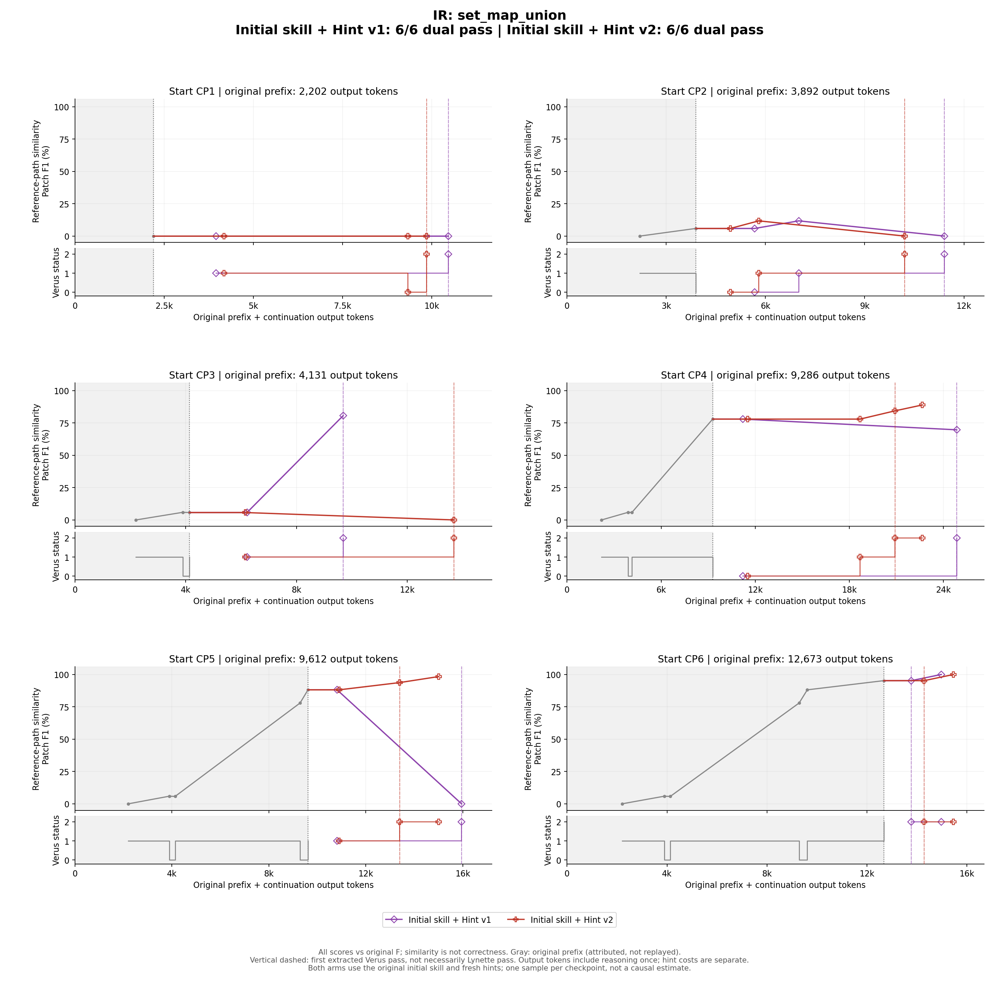

# IR：Initial skill + Hint v1 / v2 逐checkpoint对照

[今日完整hint内容核对及AC审计纠错](../HINT_CONTENT_COMPARISON.md)。完整hint原文是判断提示覆盖范围的依据，不能只取首段。

[原trace＋两版增广：去重后的信息增量审计](../INFORMATION_VALUE_AUDIT.md)。有效材料包括可解释的失败；成功率不等于新增信息量。

本题两组各6条续跑，均装备与原trace相同的initial skill，模型为DeepSeek v4 Pro，checkpoint提取与续跑条件一致。**v1/v2的hint模板不同，每个checkpoint的hint也分别重新生成，没有共用hint。** 两版对应起点的实际hint全文均不相同；文字不同不等于数学策略不同，具体以每点审计为准。

v1要求诊断当前缺口并给出逻辑提示；v2在此基础上要求另行检查有证据支持的结构兼容风险，区分已观察到的Lynette失败、潜在风险和无证据风险，不能泛称所有导入都会失败。两版保持简短逻辑指导，不提供整段最终proof。这里的v1/v2是prompt版本；JSON里的`schema_version: hint-v1`是共用数据格式标识，不代表两版提示内容相同。

[Hint v1模板](../prompts/v1/hint_system.md) · [Hint v2模板](../prompts/v2/hint_system.md) · [原v1详细报告](v1/REPORT.md) · [原v2详细报告](v2/REPORT.md)

| 版本 | 最终Verus＋Lynette通过 | Actor输出token合计 |
|---|---:|---:|
| v1 | 6/6 | 50,950 |
| v2 | 6/6 | 50,657 |

每点只各跑一次，模板版本和生成内容同时变化；同起点对照能描述采纳、失败和成本差异，不能证明哪个提示稳定更优。旧blank组未混入此对照。

横轴为原前缀归属token＋续跑actor输出token；原前缀未实际回放，hint生成成本另计。上图Patch F1是相对原F的参考路径相似度，不是正确性评分；下图为Verus状态，首次Verus通过不等于最终Lynette也通过。

## 先读懂原题与原F

目标是`(s1 + s2).map(f) == s1.map(f) + s2.map(f)`，即“先取并集再映射”与“分别映射再取并集”相等。原F采用集合外延性：固定输出元素x，分别证明左右成员关系。正向从并集的映像中取a，利用a属于s1或s2；逆向从某一侧映像取a，再把a放回并集。两方向都必须先获得成员条件，才能合法选择存在见证。

原trace的CP1为空证明；CP2卡宏名称；CP3卡成员等价；CP4首先卡非法trigger；CP5缺choose所需前提；CP6数学已经成立，只剩宏引用／结构兼容。它们不是六道独立题，也不是六个从零解题样本。另一条合法路线是直接复用vstd中已经证明同一分配律的`lemma_map_union_commute`：这是证明依赖的变化，不是绕过验证。

[原题源码](original_input.rs) · [原F全文](original_final.rs)

## CP1：同一起点，两版如何处理

**直接对照。** 本轮v2也走库路线，但先猜错自由函数路径再改方法调用；两者终点策略相同，过程错误不同。

| 版本 | Actor输出token | 源码变化次数 | 最终双通过 |
|---|---:|---:|---|
| v1 | 9,201 | 1 | 通过 |
| v2 | 8,635 | 2 | 通过 |

### v1：转用标准库定理

**客观起点（原trace事件24）。** 空proof，目标为集合映射对并集的分配律。

**Hint作何判断。** 建议外延性、双向成员关系和受前提保护的见证；兼容句建议限定宏路径。数学方向正确，但不是唯一解法。

**实际编辑与验证顺序。** 事件73直接调用s1.lemma_map_union_commute(s2,f)，75 Verus、80 Lynette通过。此前查阅vstd，未手写hint建议的双向见证，也未新增导入。

**为什么这些修改有效，或仍然失败。** 这里没有发生“把choose证明压缩成一句无依据断言”。调用的是允许库内已有定理，其合同覆盖当前分配律；Verus负责检查调用和当前目标的衔接。因而与原F相比，关键变化是由本地双向见证转为定理复用，而不是省略一个必须由本题重新证明的事实。

**Hint究竟起了什么作用。** hint提供的是可行手写路线，actor没有实现它。可以观察到actor遵守了不新增导入的边界，但不能由此推出hint促成了库检索或替它选出了该定理。

**同起点两版对照。** 本轮v2也走库路线，但先猜错自由函数路径再改方法调用；两者终点策略相同，过程错误不同。 见[另一版CP1](v2/REPORT.md#cp1)。

**语义审计结论。** 合法库定理复用；与原F的见证构造不同。数学hint未直接落实，不能说提示教会了该定理。

**最终检查边界。** 宿主Verus=通过，Lynette=通过；该结论对应链接中的最终candidate hash，不用中途通过替代终点检查。

本次实际发送的hint全文

The empty body gives Verus no proof of the set equality. Prove it by set extensionality: for an arbitrary element x, show x is in (s1 + s2).map(f) exactly when x is in s1.map(f) + s2.map(f). Work one implication at a time. In each direction, make the membership hypothesis active with an explicit case split before eliminating the existential witness; otherwise choose cannot prove that the witness exists. For image membership, the witness is an a with a in s1 + s2 and f(a) == x; split on whether a lies in s1 or s2 to conclude membership in the corresponding image union. In the reverse direction, split on which image supplies the witness. Invoke the vstd set-extensionality mechanism by full path rather than adding a top-level import, because an added import can change generated Rust and fail the Lynette comparison. Check with run_verus after this, then run_lynette.

[起点源码](checkpoints/CP01.rs) · [hint原文件](v1/CP01/hint.json) · [全部修改与工具反馈](v1/CP01/PROCESS.md) · [最终源码](v1/CP01/final.rs) · [最终验证](v1/CP01/result.json)

### v2：库路线先猜错API再修正

**客观起点（原trace事件24）。** 空proof，目标分配律未建立。

**Hint作何判断。** 仍建议外延性和双向见证，兼容提醒不加顶层导入。

**实际编辑与验证顺序。** 63猜自由函数vstd::set_lib::lemma_map_union_commute，65报E0425；71改成s1的方法调用，73／78双通过。

**为什么这些修改有效，或仍然失败。** 第一次库调用使用了不存在的自由函数入口，因而不是一个已完成的合法证明。后面改用Set对象的方法接口，才让Verus检查真实定理合同并完成目标。错误在API位置／调用形式，不在分配律本身，也不能拿第一次调用当可复用知识。

**Hint究竟起了什么作用。** actor避开新增导入，但没有按照hint构造双向见证。不能把API修正说成hint已经预先解决的问题；该错误是在实际检索和编译反馈后修好的。

**同起点两版对照。** v1直接使用正确方法接口，少一次编译失败；本点不能用来宣称v2过程普遍优于v1。 见[另一版CP1](v1/REPORT.md#cp1)。

**语义审计结论。** 合法库路线最终成立；错误API来自actor实现，未采用hint的手写路线。错误调用应保留失败标签。

**最终检查边界。** 宿主Verus=通过，Lynette=通过；该结论对应链接中的最终candidate hash，不用中途通过替代终点检查。

本次实际发送的hint全文

The current failure is a bare proof body: Verus cannot discharge the set-equality postcondition without proof steps. The next objective is to reduce the set equality to membership equivalence: for arbitrary x, x is in (s1+s2).map(f) exactly when x is in s1.map(f)+s2.map(f). Prove each implication separately. For left-to-right, unfold map and union membership to obtain a domain element a with f(a)=x and a in s1 or a in s2; split that disjunction and show the witness places x in the corresponding image. For right-to-left, if x belongs to either image, extract a witness from s1 or s2, then show that same a belongs to s1+s2 and maps to x. Use Verus's choose mechanism to eliminate existential map-membership hypotheses, but place it under an explicit case split so the existence assumption is available. Look for a vstd set-extensionality helper to assert equality from membership equivalence. If you use that helper, avoid adding a separate top-level import: a later state with one made Lynette report different generated Rust, while using the full path passed. Check with run_verus.sh, then run_lynette.sh.

[起点源码](checkpoints/CP01.rs) · [hint原文件](v2/CP01/hint.json) · [全部修改与工具反馈](v2/CP01/PROCESS.md) · [最终源码](v2/CP01/final.rs) · [最终验证](v2/CP01/result.json)

## CP2：同一起点，两版如何处理

**直接对照。** v2同样先修宏再查库，且保留了额外目标assert；该assert不是第三种策略。

| 版本 | Actor输出token | 源码变化次数 | 最终双通过 |
|---|---:|---:|---|
| v1 | 8,408 | 2 | 通过 |
| v2 | 7,313 | 2 | 通过 |

### v1：先修宏，再换为库证明

**客观起点（原trace事件33）。** 未限定的集合相等宏无法解析。

**Hint作何判断。** 正确指出宏作用域，且预告修复后还需成员等价／见证桥接。

**实际编辑与验证顺序。** 27改全限定宏，29暴露断言失败；53以库定理替换整个宏证明，55／60双通过。

**为什么这些修改有效，或仍然失败。** 限定宏路径解决的是名称解析，只让真正的成员等价义务暴露出来，并没有自动证明集合相等。第二次编辑改变了证明计划：移除未闭合的宏体，用覆盖整个目标的库定理结束，所以无需再逐个修原choose分支。

**Hint究竟起了什么作用。** 对“当前编译错误”和“随后数学缺口”的分层判断得到实际反馈支持。actor只直接采用第一项建议，第二层转用另一种证明依赖；不能把这两种行为一概写成“完全遵循hint”。

**同起点两版对照。** v2同样先修宏再查库，且保留了额外目标assert；该assert不是第三种策略。 见[另一版CP2](v2/REPORT.md#cp2)。

**语义审计结论。** 第一层诊断准确且被执行；数学部分转用替代路线，失败预告被验证但并未被提前避开。

**最终检查边界。** 宿主Verus=通过，Lynette=通过；该结论对应链接中的最终candidate hash，不用中途通过替代终点检查。

本次实际发送的hint全文

The current blocker is name resolution: the `assert_sets_equal` macro is not in scope under the prelude. First make the invocation resolve through vstd, preferably by qualifying the macro path rather than adding a top-level `use`, because the Lynette comparison is sensitive to extra generated Rust from imports. Re-run Verus to confirm resolution. The next proof objective is to establish extensional equality of the two set images for an arbitrary x. The current single membership equivalence is unlikely to be automatic: the SMT solver will not unfold the existential in `map` and union on its own. Work in two directions. For `(s1+s2).map(f)` containing x, expose a witness a with f(a)=x and a in s1+s2; split whether a is in s1 or s2 and conclude x lies in the corresponding image, then use union membership. For the reverse direction, split which image contains x and use that witness to show membership in the union image. Keep the witness-existence hypotheses explicit before eliminating them so the solver can use them. Check with Verus for assertion/postcondition satisfaction, then run Lynette.

[起点源码](checkpoints/CP02.rs) · [hint原文件](v1/CP02/hint.json) · [全部修改与工具反馈](v1/CP02/PROCESS.md) · [最终源码](v1/CP02/final.rs) · [最终验证](v1/CP02/result.json)

### v2：宏修复后改库定理

**客观起点（原trace事件33）。** 宏不在作用域。

**Hint作何判断。** 宏诊断与下一层成员证明预告正确。

**实际编辑与验证顺序。** 19限定宏，21断言失败；48换库定理并附目标断言，50／54双通过。

**为什么这些修改有效，或仍然失败。** 全限定宏使代码从名称错误进入证明错误；随后库定理承担了整个等式。保留在后面的assert只是重申当前结论，既不提供新前提，也不是与库定理不同的数学路径。

**Hint究竟起了什么作用。** 第一层宏提示明确被采纳，第二层数学预告也确实发生，但actor没有用hint给的手写修复来解决它。评价应是“诊断正确、数学路线改用库”。

**同起点两版对照。** v1过程结构相同，两版差异主要是搜索／输出成本和冗余断言。 见[另一版CP2](v1/REPORT.md#cp2)。

**语义审计结论。** 和v1同类路径，没有新策略；附加assert是冗余确认，不是新的核心论证。

**最终检查边界。** 宿主Verus=通过，Lynette=通过；该结论对应链接中的最终candidate hash，不用中途通过替代终点检查。

本次实际发送的hint全文

The immediate blocker is a macro-scope error: the set-equality macro is not in scope, so Verus stops before checking the proof. Make the macro reachable, but avoid adding a new top-level import just for it if possible; a recorded attempt with that import passed Verus but failed Lynette's generated-Rust comparison, while a qualified vstd-path invocation later passed both. After it compiles, the current single membership-equality assertion is insufficient. The next proof objective is set extensionality by proving the two membership directions separately for an arbitrary x. For x in (s1 + s2).map(f), explicitly assume/branch on that antecedent, extract a witness a with f(a)=x and a in s1 or s2, then case split on which set contains a and rebuild membership in the corresponding image. Prove the reverse direction similarly, branching on whether x comes from s1.map(f) or s2.map(f). Run Verus after the logical change and run Lynette to check generated-Rust equivalence.

[起点源码](checkpoints/CP02.rs) · [hint原文件](v2/CP02/hint.json) · [全部修改与工具反馈](v2/CP02/PROCESS.md) · [最终源码](v2/CP02/final.rs) · [最终验证](v2/CP02/result.json)

## CP3：同一起点，两版如何处理

**直接对照。** v2在同起点直接转库定理，因此这里是本轮能明确区分证明实现的配对点。

| 版本 | Actor输出token | 源码变化次数 | 最终双通过 |
|---|---:|---:|---|
| v1 | 6,449 | 1 | 通过 |
| v2 | 10,562 | 1 | 通过 |

### v1：一次补双向见证及兼容清理

**客观起点（原trace事件40）。** 成员等价断言未证明，起点另含顶层宏导入。

**Hint作何判断。** 提示分解两个方向、在成员前提下选择见证，并清理导入。

**实际编辑与验证顺序。** 31同时删除导入、限定宏并补两个有前提分支的见证证明；33／38双通过。

**为什么这些修改有效，或仍然失败。** 正向分支先假设x属于并集映像，才能选择映射到x的a，并按a在s1还是s2分情况。逆向则先确定x在哪个映像中，再选择对应a放入并集。事件31在一轮编辑里补齐这条完整链；一轮编辑包含多个有依赖关系的事实，不等于“只复制结论”。

**Hint究竟起了什么作用。** hint的双向分解、前提保护和限定宏三项都能对应到实际差分，且随后两检查通过。这支持“提示被落实”的判断；没有对actor是否独立想到这条路线作不可验证推断。

**同起点两版对照。** v2在同起点直接转库定理，因此这里是本轮能明确区分证明实现的配对点。 见[另一版CP3](v2/REPORT.md#cp3)。

**语义审计结论。** 提示与修改直接对应，整段修复的论证链合理；一次修改不等于逻辑跳步。

**最终检查边界。** 宿主Verus=通过，Lynette=通过；该结论对应链接中的最终candidate hash，不用中途通过替代终点检查。

本次实际发送的hint全文

Verus is failing the single equality inside the set-extensionality macro because it cannot automatically relate the existential membership condition of (s1 + s2).map(f) to the disjunctive membership condition of s1.map(f) + s2.map(f). The next proof objective is to discharge the extensionality argument as two separate implications. For left-to-right, when x is in the left image, unfold that membership to obtain a witness a in s1 + s2 with f(a) = x, then split on whether a lies in s1 or s2 and use the corresponding image membership to prove x is in the right union. For right-to-left, assume x is in the right union and split on which image witnesses it, then reuse that witness to prove x is in the left image. Important: put the antecedent into context with an explicit case split before using choose; otherwise Verus cannot prove the witness exists. Also avoid the extra top-level import for the extensionality macro in the final candidate, because it changes generated Rust compared with input.rs; call the macro by an absolute path instead.

[起点源码](checkpoints/CP03.rs) · [hint原文件](v1/CP03/hint.json) · [全部修改与工具反馈](v1/CP03/PROCESS.md) · [最终源码](v1/CP03/final.rs) · [最终验证](v1/CP03/result.json)

### v2：一次转库并清理导入

**客观起点（原trace事件40）。** 成员等价断言失败，另有顶层宏导入。

**Hint作何判断。** 建议双向见证及兼容清理，前者可行而非必须。

**实际编辑与验证顺序。** 79删除导入并以库定理取代宏证明，81／86双通过。

**为什么这些修改有效，或仍然失败。** 本点原代码已经有宏和未闭合成员等价，但actor将整段改为库定理。该方法直接覆盖目标，因而不需要继续构造a的见证。删除额外导入与更换数学实现同轮发生，后续双通过支持最终版本合规。

**Hint究竟起了什么作用。** 提示的兼容检查原则得到落实，外延见证方案没有得到落实。一次成功不应写成actor逐条遵循数学hint，更不能仅凭低F1说它离正确性更远。

**同起点两版对照。** v1本点一次构造了双向见证；两版都是正确终点，差异在证明所依赖的知识。 见[另一版CP3](v1/REPORT.md#cp3)。

**语义审计结论。** 只落实兼容原则，数学路线转库；与本轮v1 CP3的手写见证形成实质实现差异。

**最终检查边界。** 宿主Verus=通过，Lynette=通过；该结论对应链接中的最终candidate hash，不用中途通过替代终点检查。

本次实际发送的hint全文

The current failure is not just a missing import: the extensionality branch asserts a pointwise Boolean equality of the two membership predicates, and Verus cannot unfold map/union membership through that single assertion. Prove the pointwise membership equivalence as two separate implication directions. In each direction, once the membership antecedent is in context, expose the existential witness behind the relevant map membership and case-split on the union or image side that produced it. For left-to-right, a witness in the union is either in s1 or s2, and each case proves membership in the corresponding image. For right-to-left, split whether the witness originates from s1 or s2, then lift it back into the union before showing membership in the mapped union. Run Verus after this change; the failing Boolean equality should be replaced by a provable pointwise equivalence. Compatibility: the current added top-level macro import may affect Lynette; a later verified state with that import failed the comparison, while the final proof used a fully qualified macro path and passed, so avoid keeping that extra top-level import and rerun Lynette.

[起点源码](checkpoints/CP03.rs) · [hint原文件](v2/CP03/hint.json) · [全部修改与工具反馈](v2/CP03/PROCESS.md) · [最终源码](v2/CP03/final.rs) · [最终验证](v2/CP03/result.json)

## CP4：同一起点，两版如何处理

**直接对照。** v2将同一修复拆成trigger、前提、兼容三轮，逐层报错；两版数学路线相同，修复组织不同。

| 版本 | Actor输出token | 源码变化次数 | 最终双通过 |
|---|---:|---:|---|
| v1 | 16,649 | 1 | 通过 |
| v2 | 14,265 | 3 | 通过 |

### v1：保留原见证路线，一次修两层错误

**客观起点（原trace事件48）。** choose上的非法trigger阻塞编译；其后还需前提保证见证存在。

**Hint作何判断。** 提示删除非法trigger、补双向成员前提，避免顶层导入。

**实际编辑与验证顺序。** 78一次去导入和错误trigger，补受保护的choose及并集成员关系，使用已有axiom_set_union；80／85双通过。

**为什么这些修改有效，或仍然失败。** 非法trigger与缺见证前提是两个问题：去掉错误标注使代码可检查，成员条件分支才给choose存在性依据。补入的并集公理调用用于把并集成员关系与两侧成员关系联系起来；它来自vstd，未添加新假设。清导入只影响引用方式，不改变上述论证。

**Hint究竟起了什么作用。** 这次actor把hint预告的后续问题一起修掉，因此修后未经历中间choose和Lynette失败。但前面有大量查阅，不能用一次snapshot变化来代表一次很小、很快的推理。

**同起点两版对照。** v2将同一修复拆成trigger、前提、兼容三轮，逐层报错；两版数学路线相同，修复组织不同。 见[另一版CP4](v2/REPORT.md#cp4)。

**语义审计结论。** 数学和兼容提醒均落实。虽一次编辑，前置检索耗时较长，不能等同低成本或瞬间完成。

**最终检查边界。** 宿主Verus=通过，Lynette=通过；该结论对应链接中的最终candidate hash，不用中途通过替代终点检查。

本次实际发送的hint全文

The current failure is a trigger-syntax rejection: #[trigger] is attached to the whole existentially quantified condition involving a union membership and f(a) == x, but Verus triggers must be a function call, field access, or arithmetic operator. The immediate objective is to make each choose expression syntactically legal by removing that invalid trigger annotation. After that, the proof still has a logical gap: choose must establish that a witness exists, and inside the implication proof blocks the antecedent is not automatically assumed. Before selecting a witness, case-split explicitly on the relevant image-membership hypothesis so its existential witness is available. Then propagate that witness through the union and image definitions. For the image-of-union to union-of-images direction, split on whether the witness lies in s1 or s2; for the reverse direction, split on which image contains the value. Also keep the set-equality macro invocation fully qualified rather than adding a new top-level import to avoid deghosting differences later. Re-run Verus after the change; once it passes, run the comparison check.

[起点源码](checkpoints/CP04.rs) · [hint原文件](v1/CP04/hint.json) · [全部修改与工具反馈](v1/CP04/PROCESS.md) · [最终源码](v1/CP04/final.rs) · [最终验证](v1/CP04/result.json)

### v2：提示准确，分层失败仍发生

**客观起点（原trace事件48）。** 非法trigger，其后还有见证前提与额外导入。

**Hint作何判断。** 三层问题均有提示。

**实际编辑与验证顺序。** 70删trigger，72 choose失败；78补成员前提分支，80 Verus通过；85 Lynette失败；91删导入并限定宏，93／97双通过。

**为什么这些修改有效，或仍然失败。** 事件70只去非法trigger，未改变choose所在的逻辑上下文，所以随后存在性失败是可预期的。事件78补成员条件，才使选择见证有依据；数学通过后剩下导入差异，事件91再改变宏引用方式。三个阶段分别解决解析、证明和结构检查，不能合写成一轮正确推导。

**Hint究竟起了什么作用。** hint已提及三层问题，但actor分次落实且没有提前清导入。正向作用是提供了正确修复方向，不是避免所有失败；判断应保留这种局部性。

**同起点两版对照。** v1同点一次合并修复而双通过。v2虽然actor输出较少，仍经历更多失败状态，成本与修复轮数不是同一指标。 见[另一版CP4](v1/REPORT.md#cp4)。

**语义审计结论。** 修复顺序合理，但不能称hint提前避免了后两层失败。v1本点一次合并修复，v2反而分三次。

**最终检查边界。** 宿主Verus=通过，Lynette=通过；该结论对应链接中的最终candidate hash，不用中途通过替代终点检查。

本次实际发送的hint全文

The current Verus error is not yet about the set-equality proof itself: a choose expression is applying #[trigger] to a compound membership condition, which Verus does not accept as a valid trigger. First make the choose condition syntactically valid by removing that trigger annotation or moving it to a legal subterm. After that, do not rely on the implication proof block to supply the existential membership hypothesis; Verus needs an explicit case split on the antecedent before choosing an existential witness. In each direction, branch on the relevant membership fact, then choose the witness for the contains predicate and propagate it through set union and image membership. For the forward direction, split on mapped-union membership, obtain a witness in the union, and then case on which set contains that witness. For the reverse direction, split on union-image membership, then on which image contains x. Re-run Verus after each change to see whether the choose existence conditions and postcondition close. Compatibility reminder: the current extra top-level assert_sets_equal import is a likely Lynette difference risk; later evidence showed an imported-macro version failing Lynette while the fully qualified macro path passed, so plan to remove that import before final Lynette.

[起点源码](checkpoints/CP04.rs) · [hint原文件](v2/CP04/hint.json) · [全部修改与工具反馈](v2/CP04/PROCESS.md) · [最终源码](v2/CP04/final.rs) · [最终验证](v2/CP04/result.json)

## CP5：同一起点，两版如何处理

**直接对照。** v2本点保留见证并补if条件，之后再清导入；因此CP5两版采用不同实现。

| 版本 | Actor输出token | 源码变化次数 | 最终双通过 |
|---|---:|---:|---|
| v1 | 7,167 | 1 | 通过 |
| v2 | 6,281 | 2 | 通过 |

### v1：放弃未完成见证，复用库定理

**客观起点（原trace事件55）。** choose缺少可用的存在前提，起点有额外宏导入。

**Hint作何判断。** 建议补成员条件分支并清理导入。

**实际编辑与验证顺序。** 43删除整段见证证明和导入，改为map-union库定理；45／50双通过。

**为什么这些修改有效，或仍然失败。** 原路线在没有获得成员前件时取choose，存在性无法保证。actor没有把缺前提的choose包装成“已知”，而是删除该未完成实现，改调用库定理。最终依赖合法，原未通过语句不会因最终成功而被追认为正确。

**Hint究竟起了什么作用。** hint的具体见证方案未采纳；清导入的兼容方向被落实。这是一条可用的替代证明实现，但对“hint使原路线更顺畅”的支持较弱。

**同起点两版对照。** v2本点保留见证并补if条件，之后再清导入；因此CP5两版采用不同实现。 见[另一版CP5](v2/REPORT.md#cp5)。

**语义审计结论。** 终点正确、库调用合法；没有照hint逐步补原证明，而是更换实现。

**最终检查边界。** 宿主Verus=通过，Lynette=通过；该结论对应链接中的最终candidate hash，不用中途通过替代终点检查。

本次实际发送的hint全文

Your current failure is not the set equality itself: both choose expressions fail because their existential hypotheses are not available. In the first direction, the block proves an implication, but Verus does not automatically assume the antecedent (s1 + s2).map(f).contains(x) inside that block, so choose cannot establish a witness satisfying (s1 + s2).contains(a) && f(a) == x. The next objective is to make that membership hypothesis explicit before eliminating the existential. Put the witness elimination inside a branch guarded by the map-membership condition. Similarly, for the converse, guard on (s1.map(f) + s2.map(f)).contains(x) and then distinguish which image supplies the witness before choosing from s2. This should eliminate the cannot-prove-exists choose notes. After Verus passes, run Lynette; the current top-level use vstd::assert_sets_equal may be reported as a source difference, so prefer a fully qualified macro invocation instead.

[起点源码](checkpoints/CP05.rs) · [hint原文件](v1/CP05/hint.json) · [全部修改与工具反馈](v1/CP05/PROCESS.md) · [最终源码](v1/CP05/final.rs) · [最终验证](v1/CP05/result.json)

### v2：先补前提，再修导入

**客观起点（原trace事件55）。** choose的存在性缺少局部前提。

**Hint作何判断。** 提示双方向前提保护，并在Verus之后处理兼容检查。

**实际编辑与验证顺序。** 21加前提分支，23 Verus通过；28 Lynette失败；38删除导入、限定宏，40／45双通过。

**为什么这些修改有效，或仍然失败。** 新增if成员分支提供choose所需的存在性来源，使两方向见证都在有效前提下进行。之后宏路径清理没有新增数学事实；它只把已经通过的证明恢复为允许的文件结构。

**Hint究竟起了什么作用。** 该hint允许先处理数学、再查Lynette，因此后修导入不一定违背提示。不过提示也没有帮助本次直接避免Lynette失败，应与“预防成功”区别记录。

**同起点两版对照。** v1选择库定理并一并删导入；v2保留原手写路线，两者终点相似度差异有真实策略依据。 见[另一版CP5](v1/REPORT.md#cp5)。

**语义审计结论。** 数学hint落实；兼容处理延迟但与该提示顺序相容。保留原路线，不是新策略。

**最终检查边界。** 宿主Verus=通过，Lynette=通过；该结论对应链接中的最终candidate hash，不用中途通过替代终点检查。

本次实际发送的hint全文

Your current proof has the right set-extensionality structure, but the `choose` expressions are introduced before their existence assumptions are available. In an implication assertion, the antecedent is not automatically assumed inside the `by` proof block; the diagnostics at both failing chooses reflect exactly that missing witness-existence context. First case-split on `((s1 + s2).map(f)).contains(x)` before choosing a witness from the union map in the left-to-right direction. In the reverse direction, case-split first on `(s1.map(f) + s2.map(f)).contains(x)`, then split within that case on which image contains `x` before choosing the corresponding `s1` or `s2` witness. This should make the existing membership-propagation assertions discharge. After Verus passes, check compatibility: the extra top-level `use vstd::assert_sets_equal;` differs from the original input, and a later verified version with that import was observed to fail Lynette. Verify with `./tools/run_lynette.sh` and consider invoking the macro through its module path instead of adding that top-level import.

[起点源码](checkpoints/CP05.rs) · [hint原文件](v2/CP05/hint.json) · [全部修改与工具反馈](v2/CP05/PROCESS.md) · [最终源码](v2/CP05/final.rs) · [最终验证](v2/CP05/result.json)

## CP6：同一起点，两版如何处理

**直接对照。** v2也先复现同类错误再做相同改动；两者只适合作工具修复对照。

| 版本 | Actor输出token | 源码变化次数 | 最终双通过 |
|---|---:|---:|---|
| v1 | 3,076 | 1 | 通过 |
| v2 | 3,601 | 1 | 通过 |

### v1：仅修工具兼容性

**客观起点（原trace事件63）。** 起点Verus已通过，宏顶层导入可能导致结构比较失败。

**Hint作何判断。** 准确区分数学证明与Lynette，建议删除导入、使用全限定宏。

**实际编辑与验证顺序。** 11 Verus通过，15 Lynette失败；21仅删除导入并限定宏；23／27双通过。

**为什么这些修改有效，或仍然失败。** Verus已验证的主体无需补新事实。首次Lynette失败表明当前提交形状不符合结构检查；删除顶层宏导入并把宏引用写成全限定形式，保留相同证明体，解决的是这一层要求。不能把Lynette失败解释成分配律证明不成立。

**Hint究竟起了什么作用。** 提示与后续最小修复完全对应，但actor先复现错误再改，属于确认诊断后修复，不是从未发生兼容失败。

**同起点两版对照。** v2也先复现同类错误再做相同改动；两者只适合作工具修复对照。 见[另一版CP6](v2/REPORT.md#cp6)。

**语义审计结论。** 没有新数学证明。属于已有正确证明的工具兼容修复，不能算新的解题策略。

**最终检查边界。** 宿主Verus=通过，Lynette=通过；该结论对应链接中的最终candidate hash，不用中途通过替代终点检查。

本次实际发送的hint全文

The current proof already passes Verus, but that is not the terminal condition: Lynette compares the deghosted/generated Rust against input.rs. This candidate introduces a top-level import of the set-equality macro that input.rs does not have, which is likely to make Lynette report `Files are different`. The next repair objective is a compatibility fix, not further mathematical proof: retain the existing set-extensionality argument and its case-splitting witnesses unchanged, but eliminate the extra top-level import's effect on generated Rust by referring to the macro through its full qualified path at the one call site. Then rerun Verus to confirm the proof still verifies, and especially rerun Lynette to confirm generated-Rust equivalence. Do not add any other top-level declaration absent from input.rs.

[起点源码](checkpoints/CP06.rs) · [hint原文件](v1/CP06/hint.json) · [全部修改与工具反馈](v1/CP06/PROCESS.md) · [最终源码](v1/CP06/final.rs) · [最终验证](v1/CP06/result.json)

### v2：复现兼容错误后最小清理

**客观起点（原trace事件63）。** 起点数学已通过。

**Hint作何判断。** 提示不重做数学，只清理额外导入及限定宏。

**实际编辑与验证顺序。** 19 Verus通过、23 Lynette失败；29清理，32／37双通过。

**为什么这些修改有效，或仍然失败。** 同一候选先Verus通过、后Lynette失败，证明数学与结构判定各有职责。最后仅移除导入并限定宏，说明无需重证分配律；把这条续跑算作新的证明发现会夸大增广多样性。

**Hint究竟起了什么作用。** hint准确指向该最小修复，actor也没有额外重写正确主体。它的价值更接近工具使用经验，而非新的数学分解。

**同起点两版对照。** v1同样先复现后修复；v2输出略多，不能从相同成功终点反推提示更有效。 见[另一版CP6](v1/REPORT.md#cp6)。

**语义审计结论。** 与v1同类兼容修复，不能计为证明创新。

**最终检查边界。** 宿主Verus=通过，Lynette=通过；该结论对应链接中的最终candidate hash，不用中途通过替代终点检查。

本次实际发送的hint全文

Verus already verifies this checkpoint, so the remaining issue is the proof-only compatibility check, not further mathematical proof. The current candidate adds a top-level macro import for set extensionality; with exactly this source, Lynette compare against input.rs was observed to fail with 'Files are different'. Repair this by avoiding that added top-level import and invoking the macro through its qualified module path at the use site instead. After the minimal change, rerun Verus to confirm it still reports 1 verified, 0 errors, then rerun Lynette and confirm it no longer reports 'Files are different' and exits successfully. Do not change the function signature, specification, or executable behavior; the proof body can remain logically unchanged. If Lynette still reports a difference, inspect the generated-Rust comparison rather than weakening or assuming the proof goal.

[起点源码](checkpoints/CP06.rs) · [hint原文件](v2/CP06/hint.json) · [全部修改与工具反馈](v2/CP06/PROCESS.md) · [最终源码](v2/CP06/final.rs) · [最终验证](v2/CP06/result.json)

## 使用与证据边界

逐点结论针对保存的真实代码和工具反馈。成功终点可进入待格式整理的训练候选，但失败中间态必须标错，不能把hint预测、错误API或actor自述当成有效事实。AC v1 CP1与v2 CP3为未解对照，不混入成功数据。尚未评估SkillOpt收益。

本报告整合两版已有详细审计，未重新运行实验；完整hint、每次编辑、工具反馈、最终源码与验证仍可从各点链接打开。所有本地链接使用相对路径，原数据未修改。
