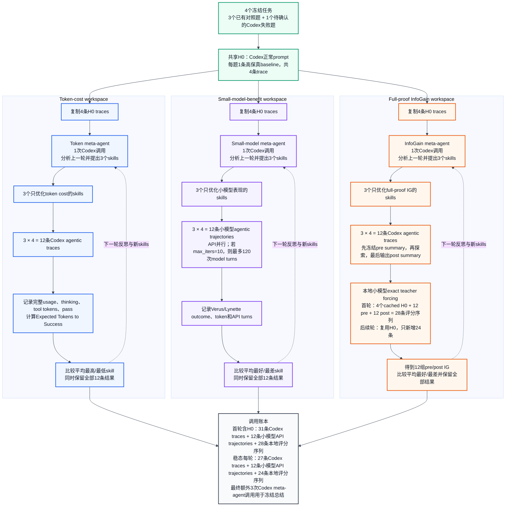

# Three-Objective Skill Evolution Loop

The diagram shows the proposed `n=4` pilot: one shared Codex H0 collection,
followed by three isolated objective-specific evolution workspaces. Each
meta-agent deliberately overfits one metric and sees only its own workspace.

